# dynamic-io-pool-benchmark-suite
## hdd
### read-buffered-inc-background-load
#### number of items: 200
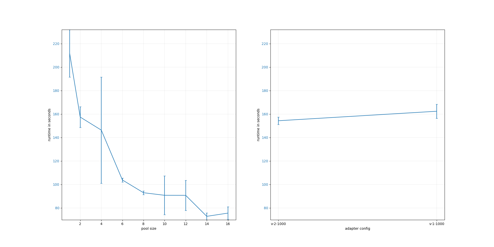{ width=100% }

### read-buffered-inc-load
#### number of items: 1000
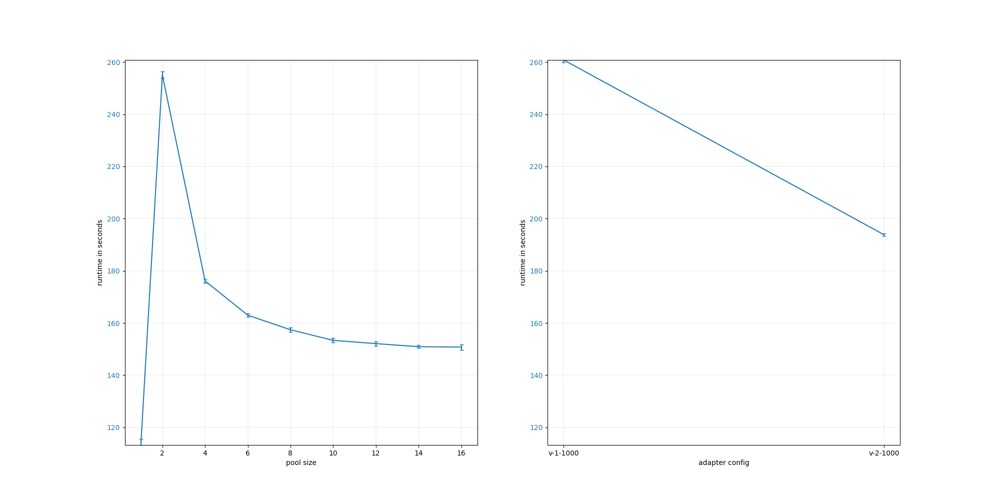{ width=100% }

### read-buffered-static-load
#### number of items: 1000
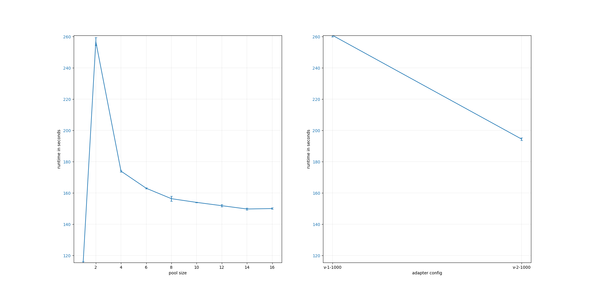{ width=100% }

### write-synced-inc-background-load
#### number of items: 20
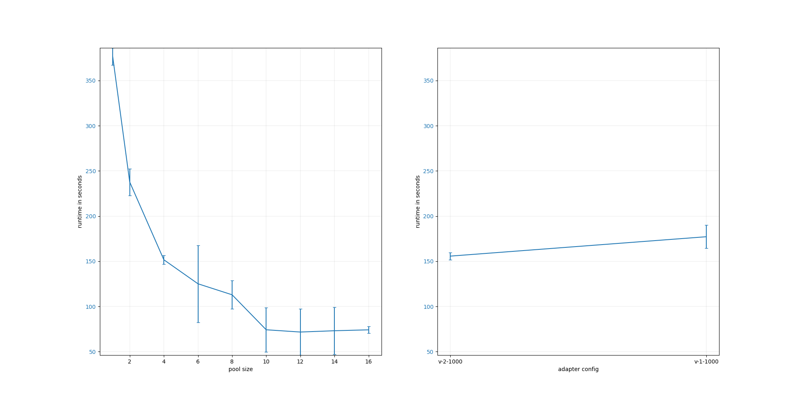{ width=100% }

### write-synced-inc-load
#### number of items: 40
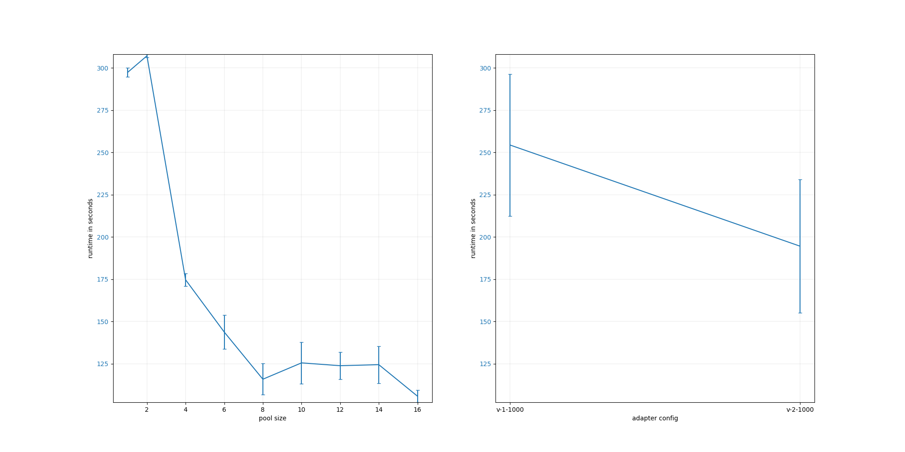{ width=100% }

### write-synced-static-load
#### number of items: 40
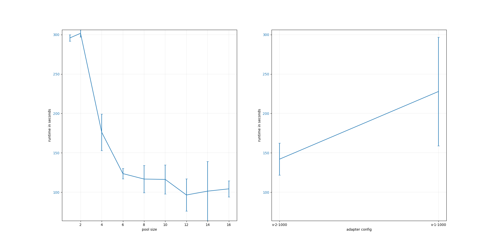{ width=100% }

## ssd
### read-buffered-inc-background-load
#### number of items: 1000
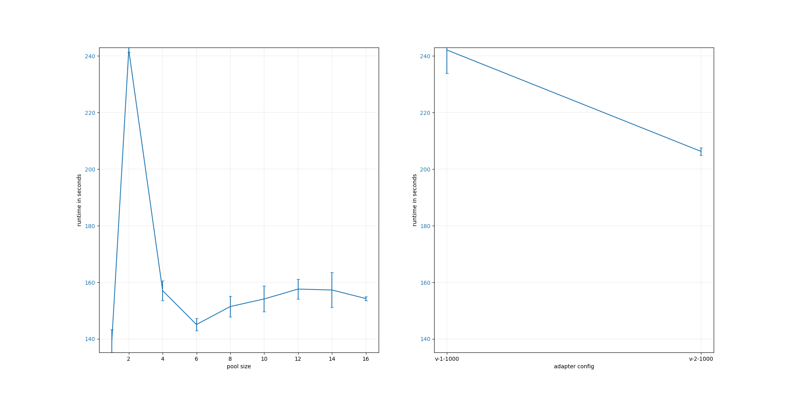{ width=100% }

### read-buffered-inc-load
#### number of items: 1000
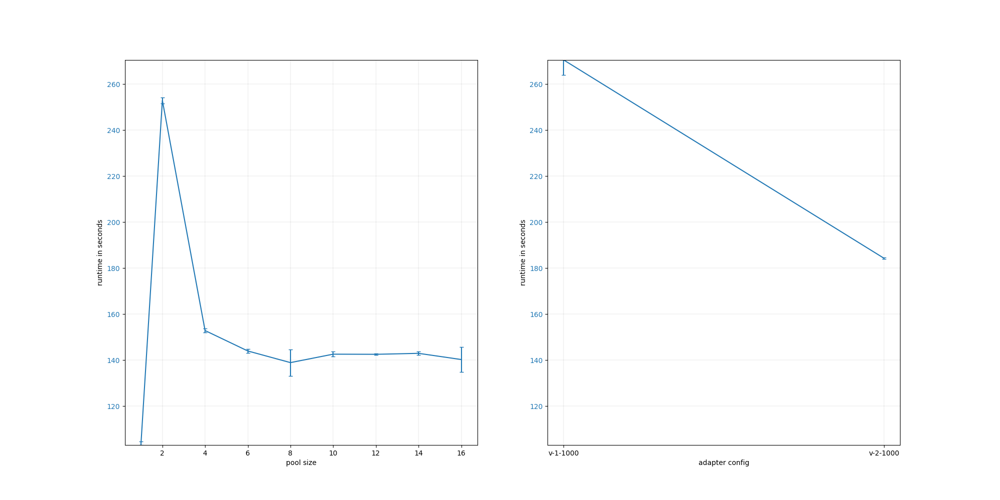{ width=100% }

### read-buffered-static-load
#### number of items: 1000
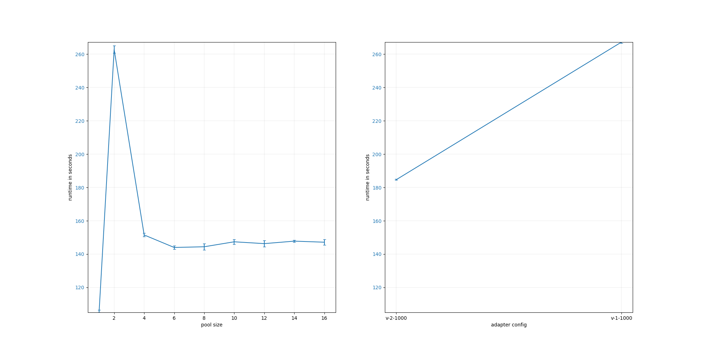{ width=100% }

### write-synced-inc-background-load
#### number of items: 1000
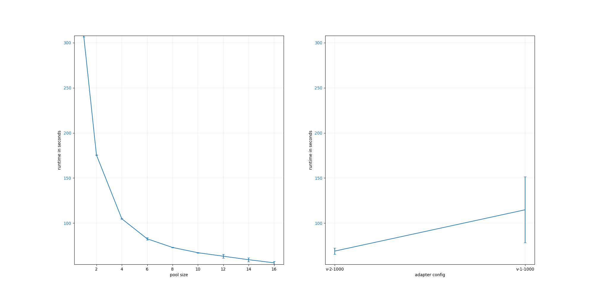{ width=100% }

### write-synced-inc-load
#### number of items: 2000
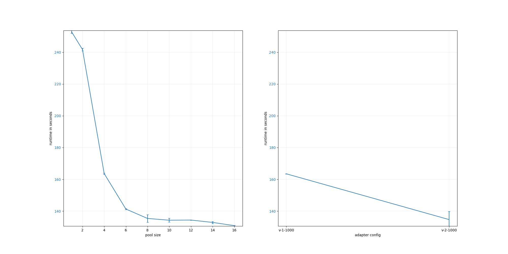{ width=100% }

### write-synced-static-load
#### number of items: 2000
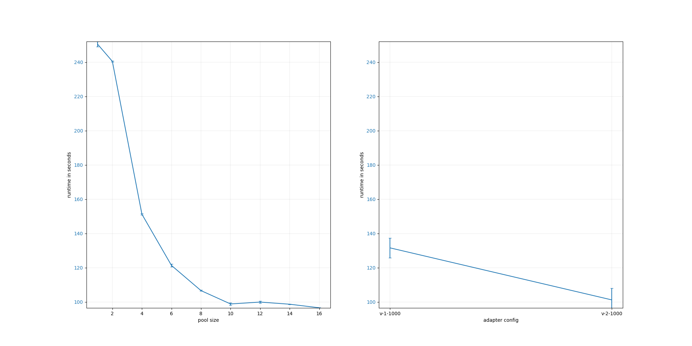{ width=100% }

