# rust-threadpool-multi-phase
## hdd
## ssd
### lml-rw_buf_100ms-3000
#### v-2-1000,0.95
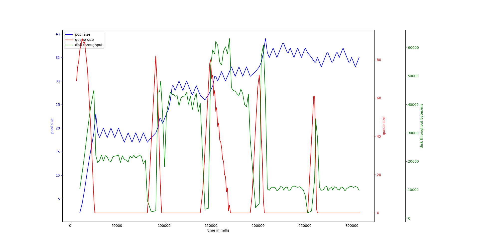{ width=100% }
avg pool size: 28.4

#### v-2-1000,0.9
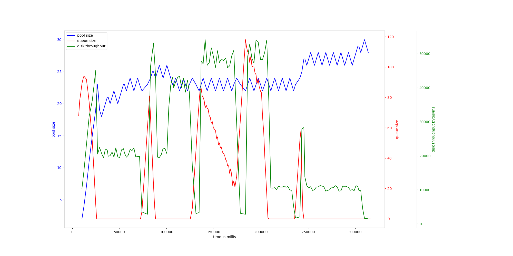{ width=100% }
avg pool size: 23.478571428571428

### lml-rw_100kb-300000
#### v-2-1000,0.9
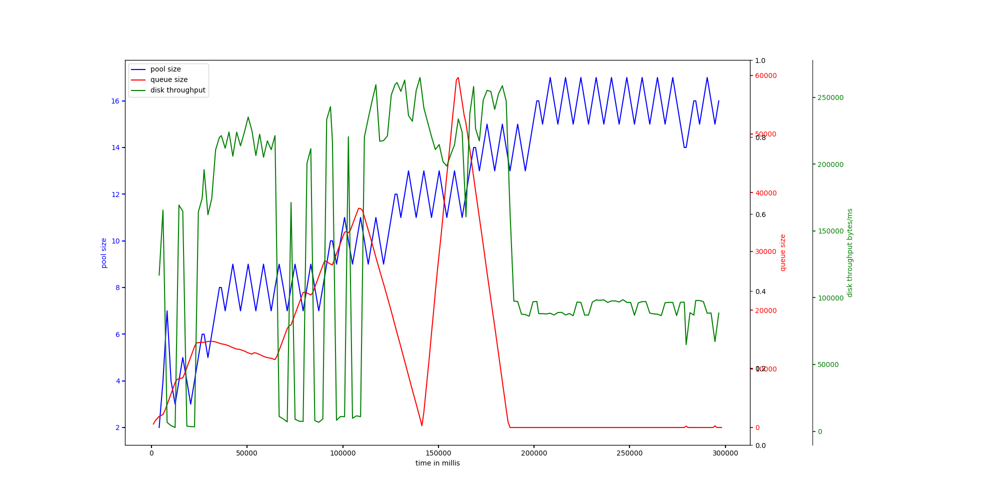{ width=100% }
avg pool size: 11.733333333333333

#### v-2-1000,0.95
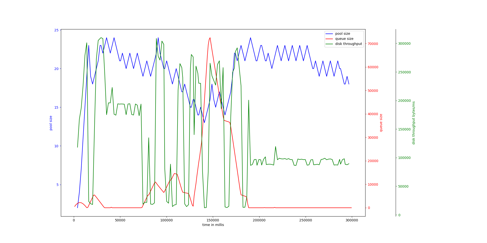{ width=100% }
avg pool size: 19.575163398692812

# rust-threadpool-single-phase
## hdd
## ssd
### rw_100kb_100us-200000
#### v-2-1000,0.9
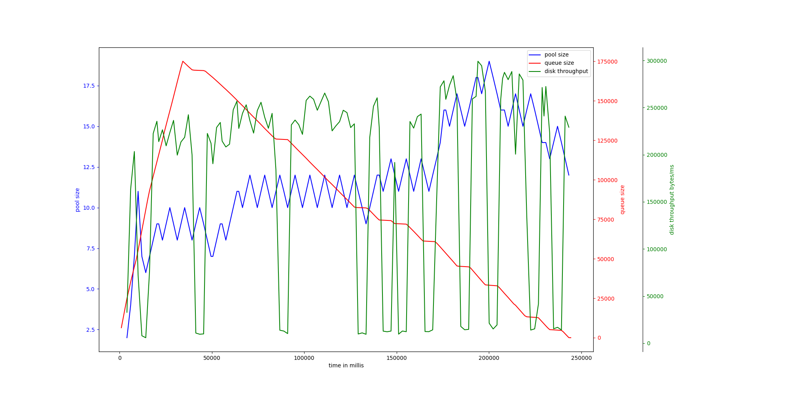{ width=100% }
avg pool size: 11.838709677419354

#### v-2-1000,0.95
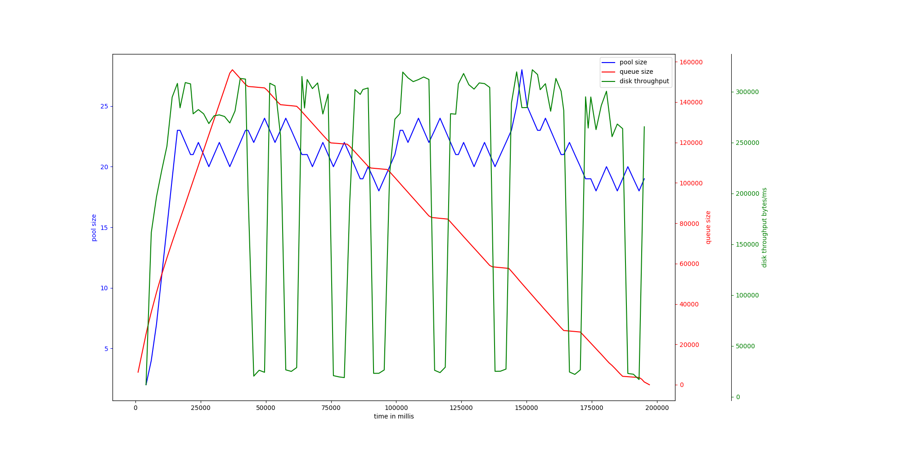{ width=100% }
avg pool size: 20.702970297029704

### rw_buf_1mb_100ms-1000
#### v-2-1000,0.9
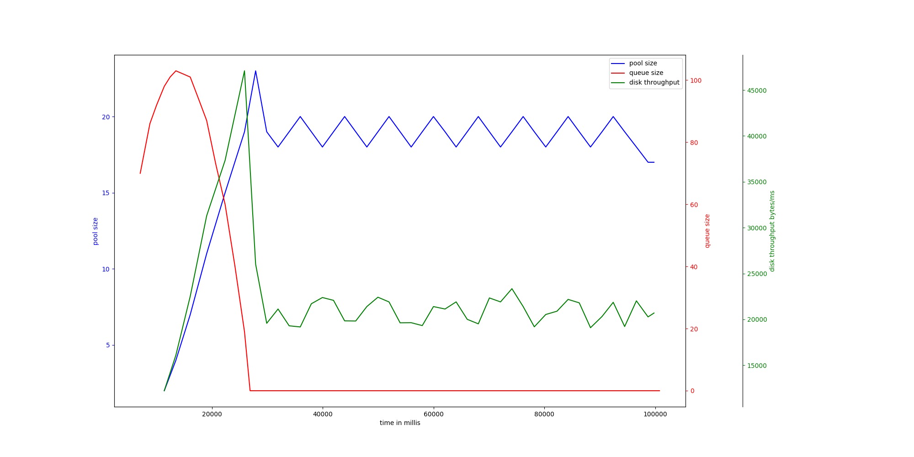{ width=100% }
avg pool size: 17.674418604651162

#### v-2-1000,0.95
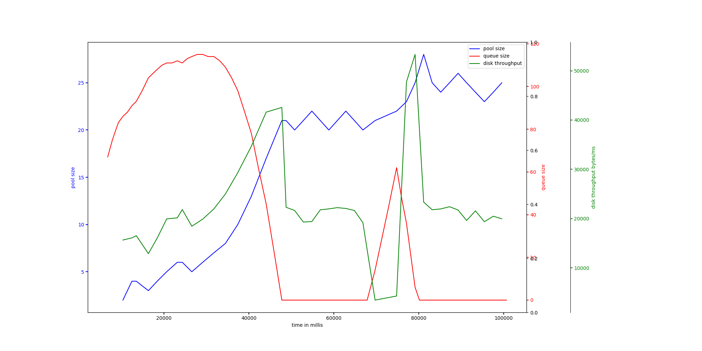{ width=100% }
avg pool size: 16.75

### rw_buf_1mb_50ms-1000
#### v-2-1000,0.9
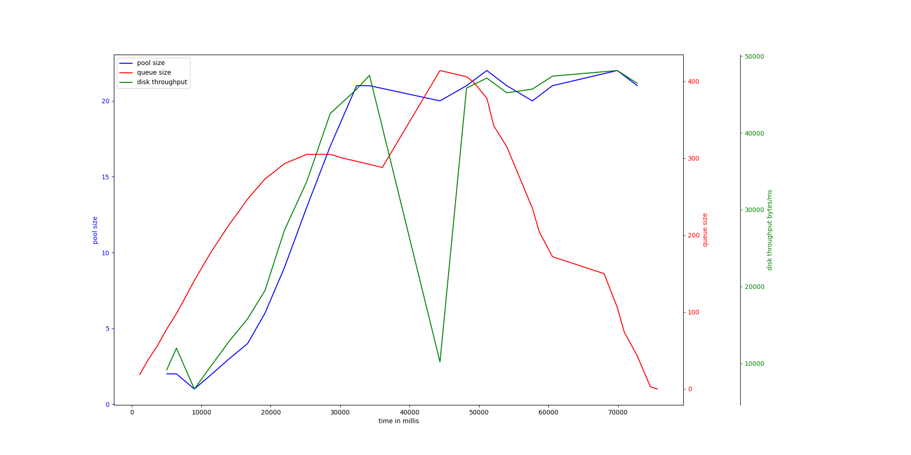{ width=100% }
avg pool size: 13.45

#### v-2-1000,0.95
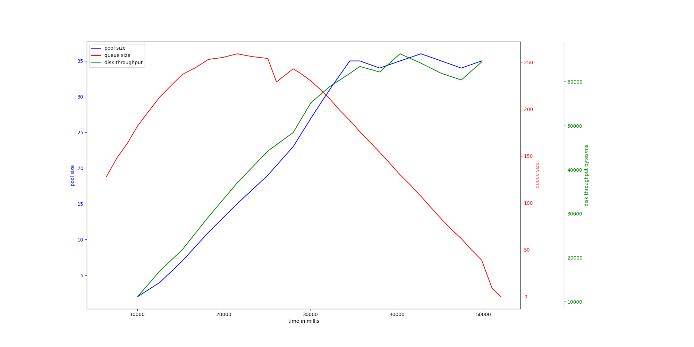{ width=100% }
avg pool size: 24.58823529411765

### rw_4kb_100us-200000
#### v-2-1000,0.95
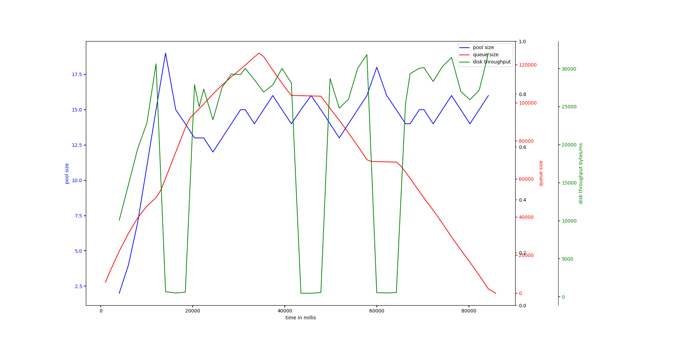{ width=100% }
avg pool size: 13.930232558139535

#### v-2-1000,0.9
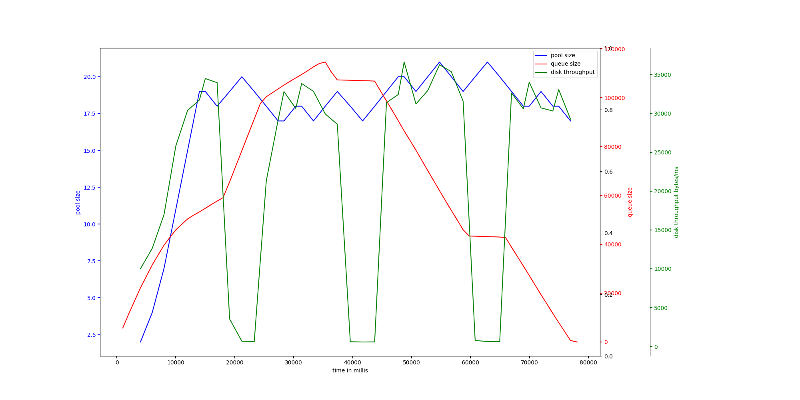{ width=100% }
avg pool size: 17.35

### rw_buf_2mb_100ms-1000
#### v-2-1000,0.9
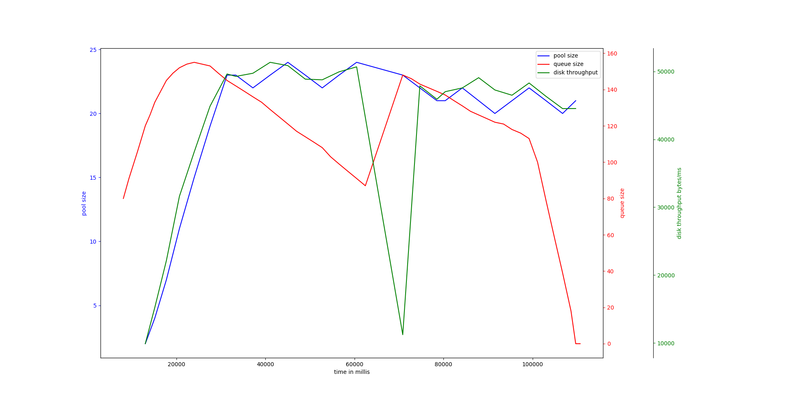{ width=100% }
avg pool size: 19.25925925925926

#### v-2-1000,0.95
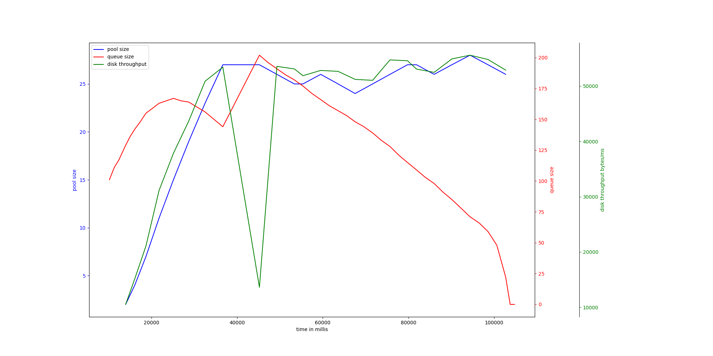{ width=100% }
avg pool size: 21.875

### rw_100kb_1ms-100000
#### v-2-1000,0.95
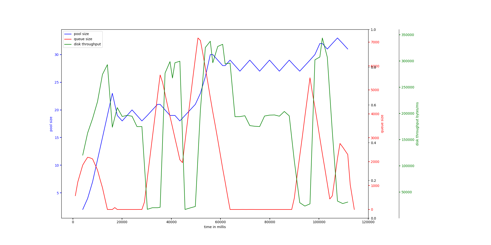{ width=100% }
avg pool size: 23.75438596491228

#### v-2-1000,0.9
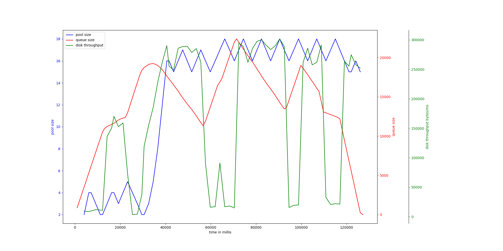{ width=100% }
avg pool size: 12.609375

