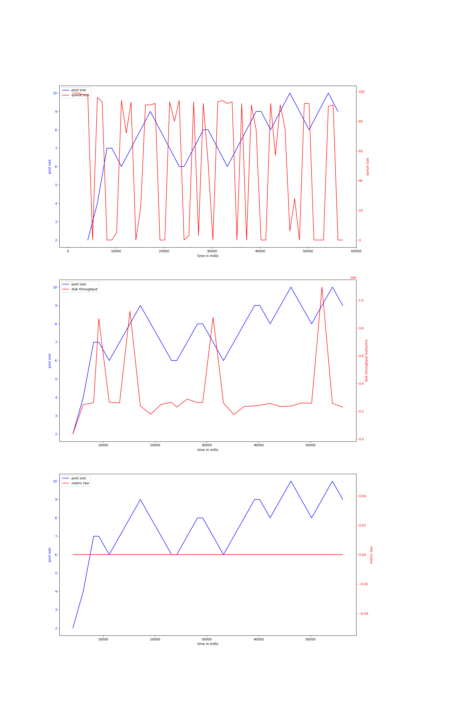
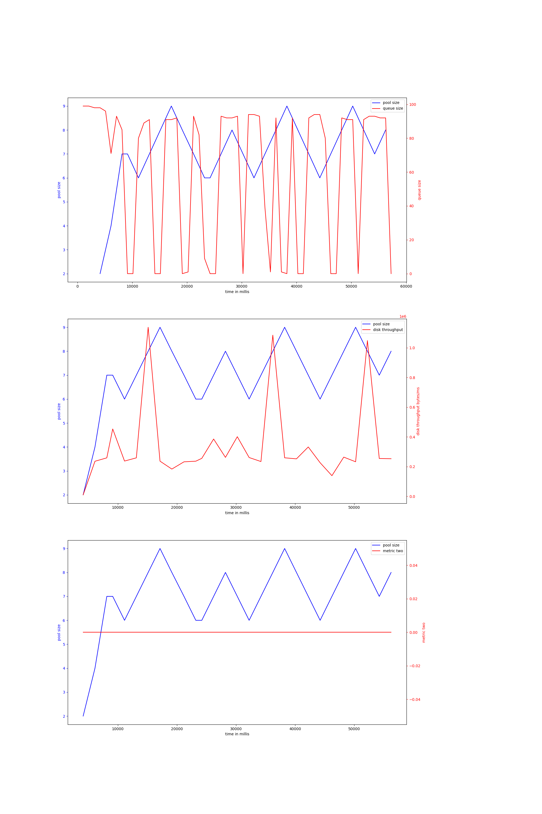
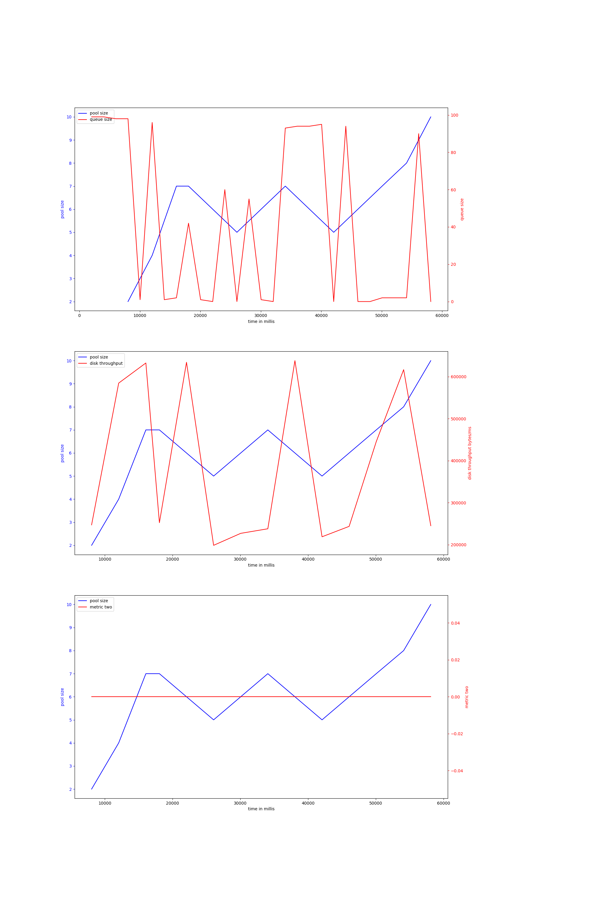
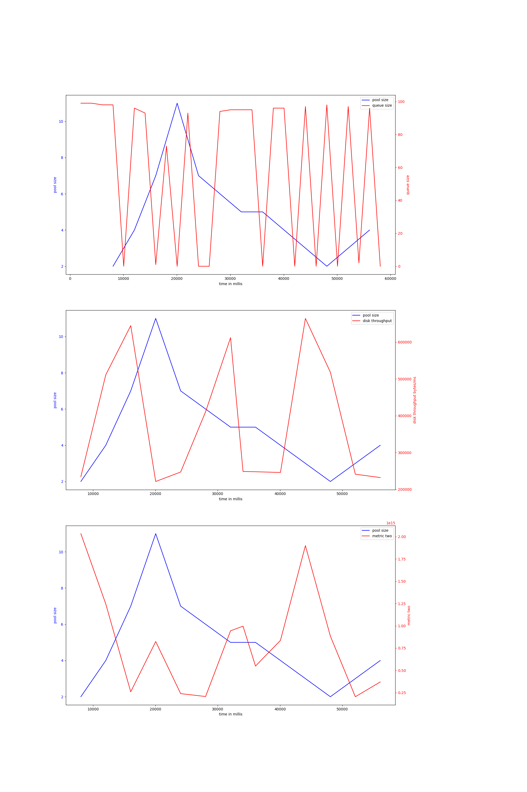
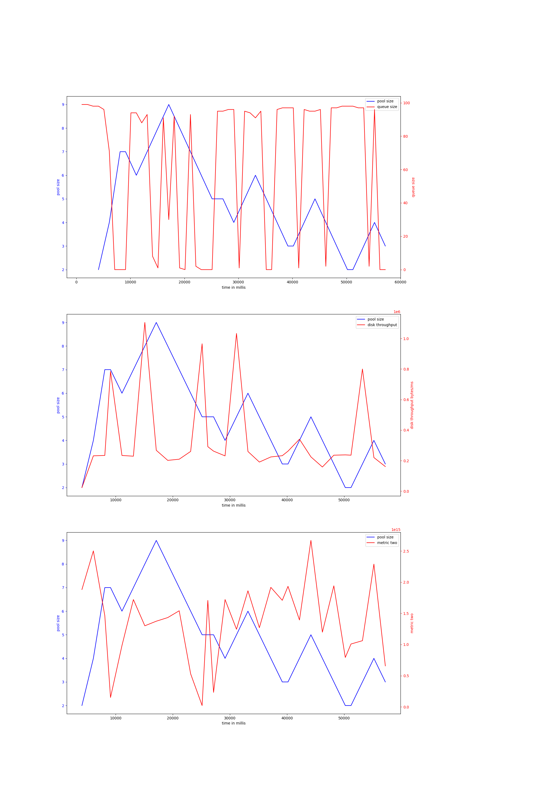
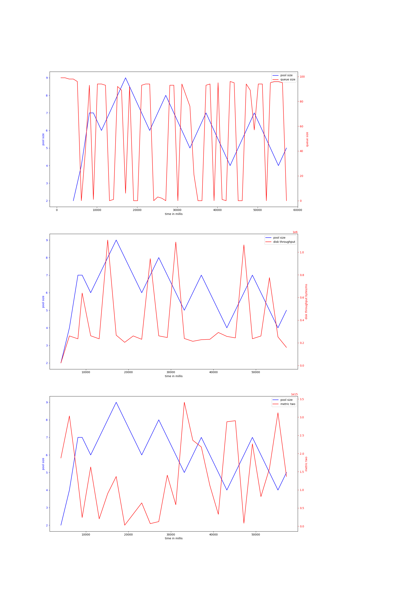
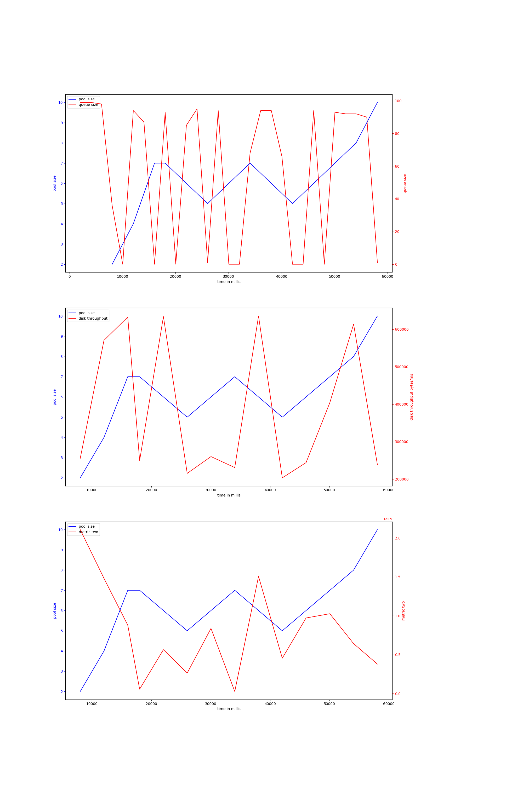

# node-io-benchmark
## hdd
## ssd
### rw_sync_10mb-node-1000
#### v-2-2000,0.95
{ width=100% }
avg pool size: 5.533333333333333

#### v-2-1000,0.95
{ width=100% }
avg pool size: 7.517241379310345

#### v-2-1000,0.9
{ width=100% }
avg pool size: 7.035714285714286

#### v-2-2000,0.9
{ width=100% }
avg pool size: 6.142857142857143

#### v-3-2000,0.95
{ width=100% }
avg pool size: 4.857142857142857

#### v-3-1000,0.9
{ width=100% }
avg pool size: 4.866666666666666

#### v-3-1000,0.95
{ width=100% }
avg pool size: 6.071428571428571

#### v-3-2000,0.9
{ width=100% }
avg pool size: 6.142857142857143

