# rocks-io-benchmark
## hdd
## ssd
### fillseq-50000000
#### v-2-1000,0.95
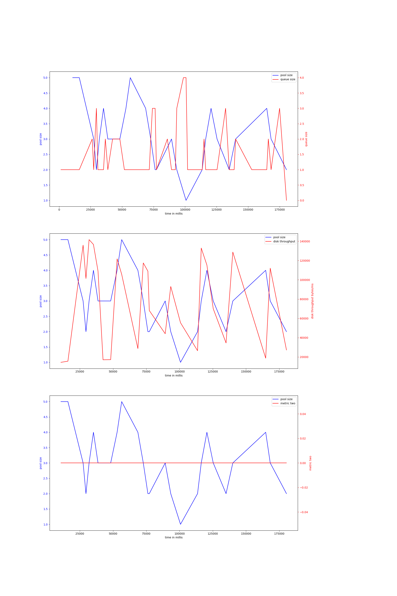{ width=100% }
avg pool size: 3.074074074074074

#### v-2-2000,0.95
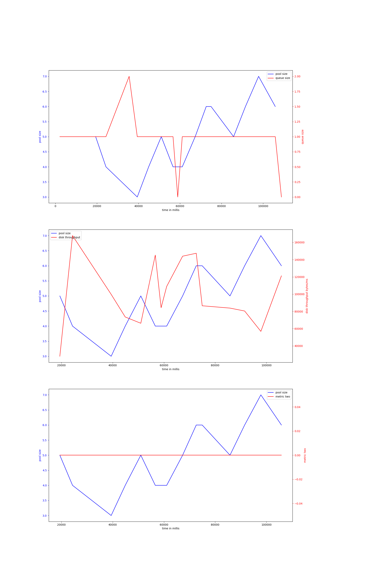{ width=100% }
avg pool size: 4.933333333333334

#### v-2-1000,0.9
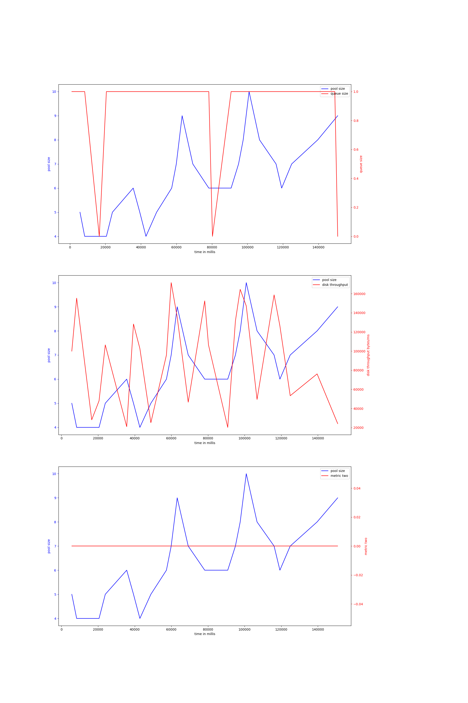{ width=100% }
avg pool size: 6.36

#### v-2-2000,0.9
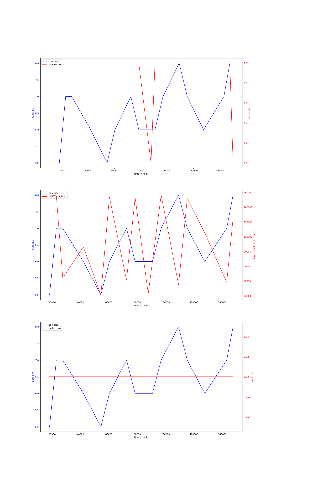{ width=100% }
avg pool size: 6.5

#### v-3-2000,0.95
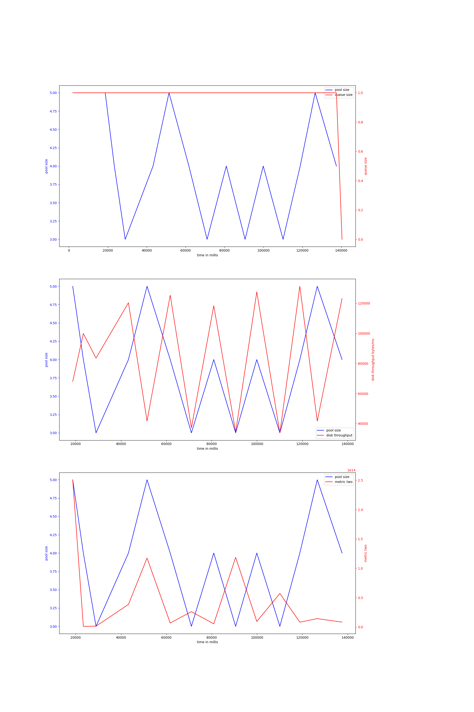{ width=100% }
avg pool size: 3.9285714285714284

#### v-3-2000,0.9
{ width=100% }
avg pool size: 4.066666666666666

#### v-3-1000,0.95
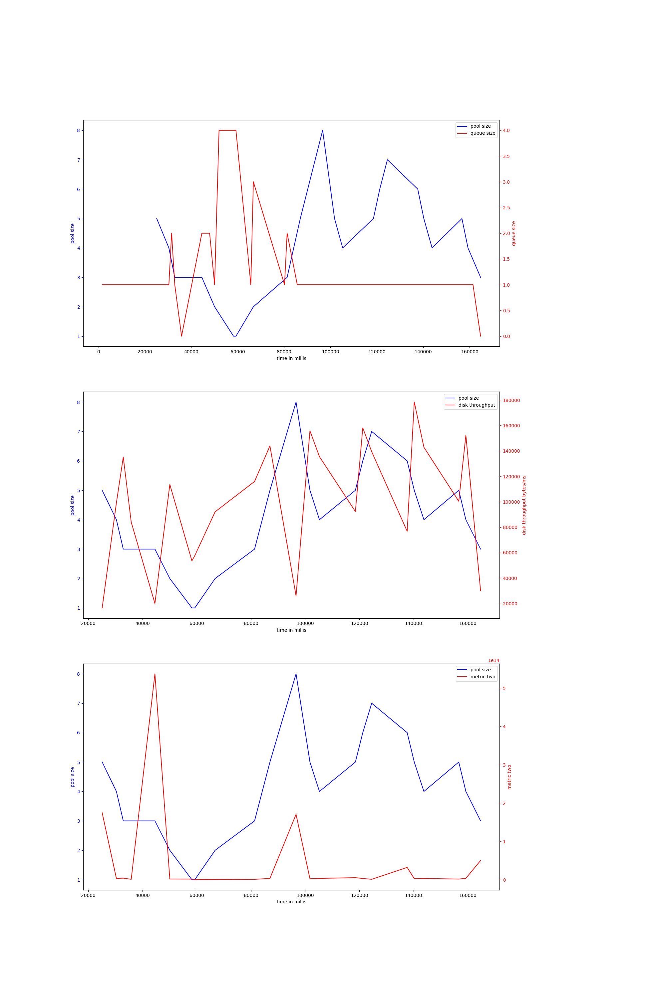{ width=100% }
avg pool size: 4.086956521739131

#### v-3-1000,0.9
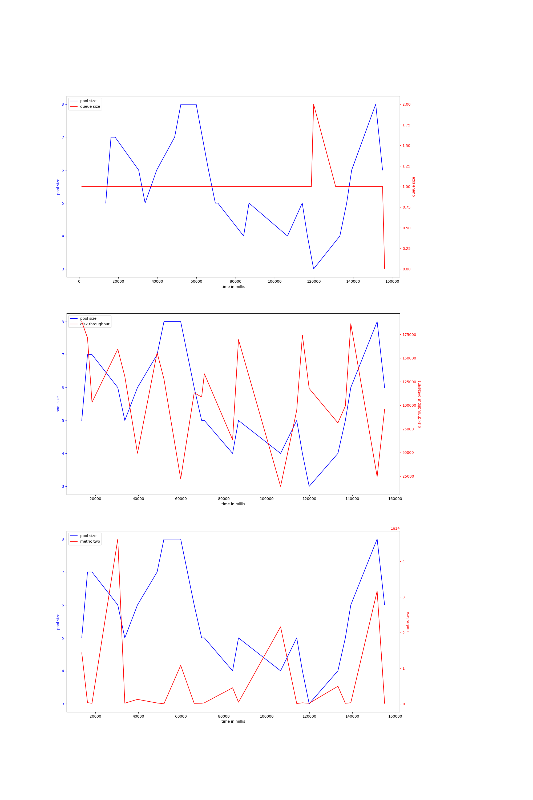{ width=100% }
avg pool size: 5.608695652173913

### bulkload-50000000
#### v-2-1000,0.95
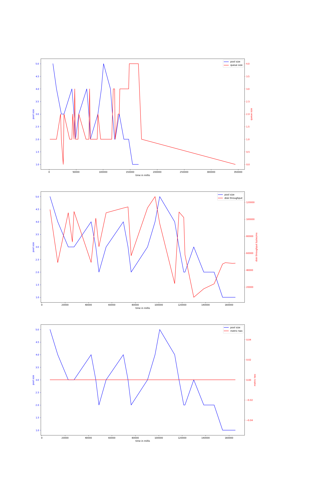{ width=100% }
avg pool size: 2.8076923076923075

#### v-2-2000,0.95
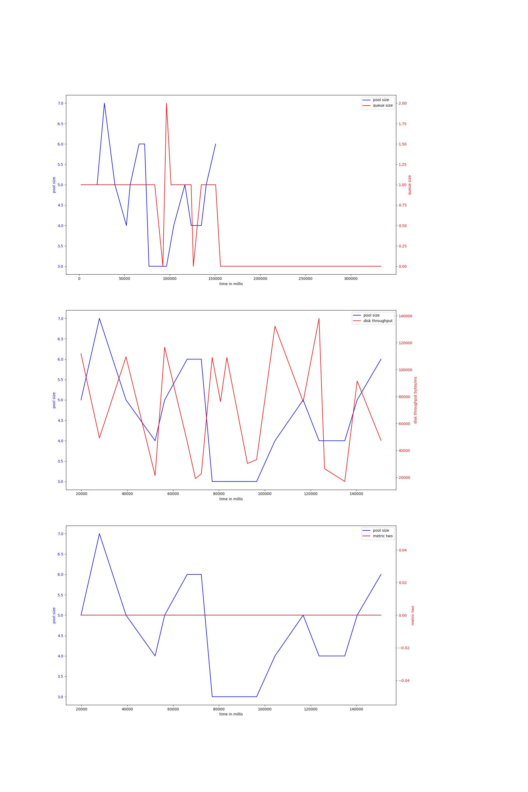{ width=100% }
avg pool size: 4.55

#### v-2-1000,0.9
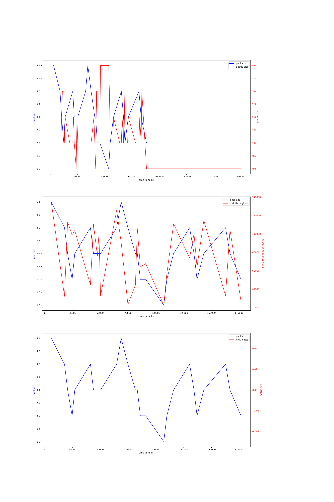{ width=100% }
avg pool size: 3.074074074074074

#### v-3-1000,0.9
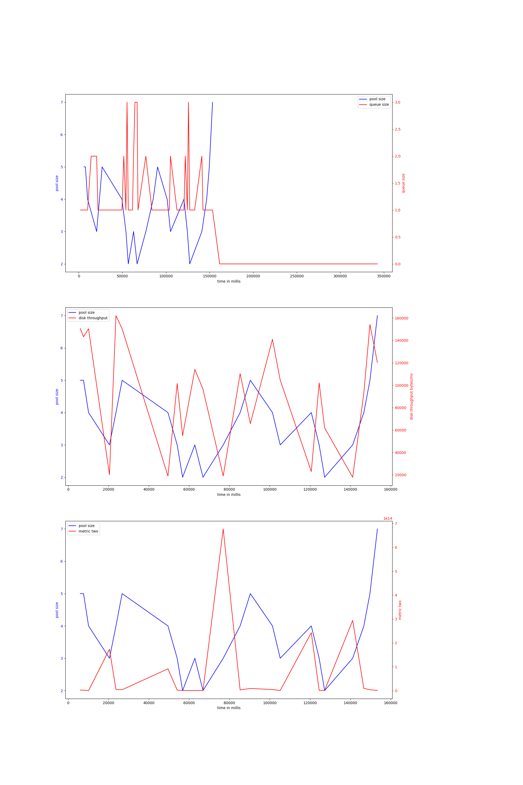{ width=100% }
avg pool size: 3.782608695652174

#### v-3-2000,0.95
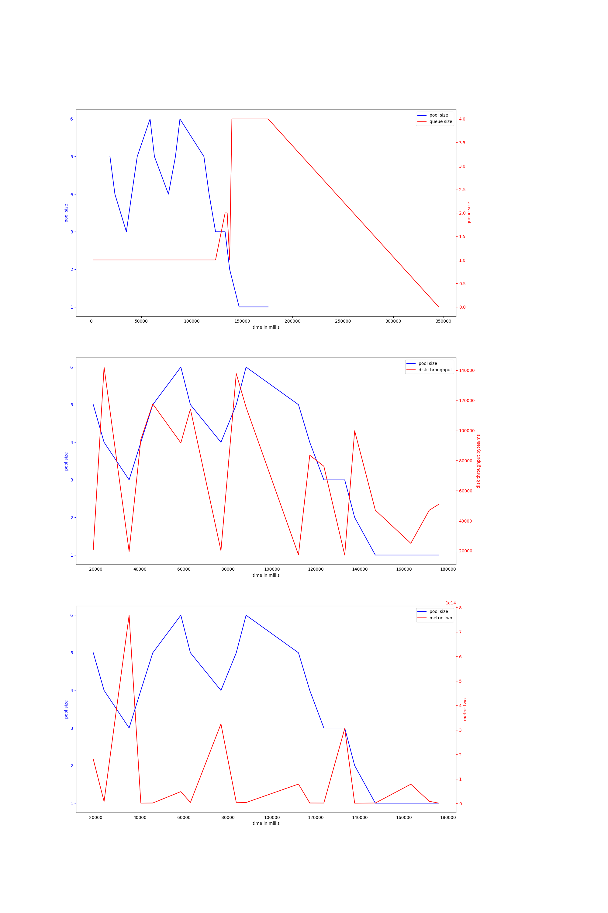{ width=100% }
avg pool size: 3.5789473684210527

#### v-3-2000,0.9
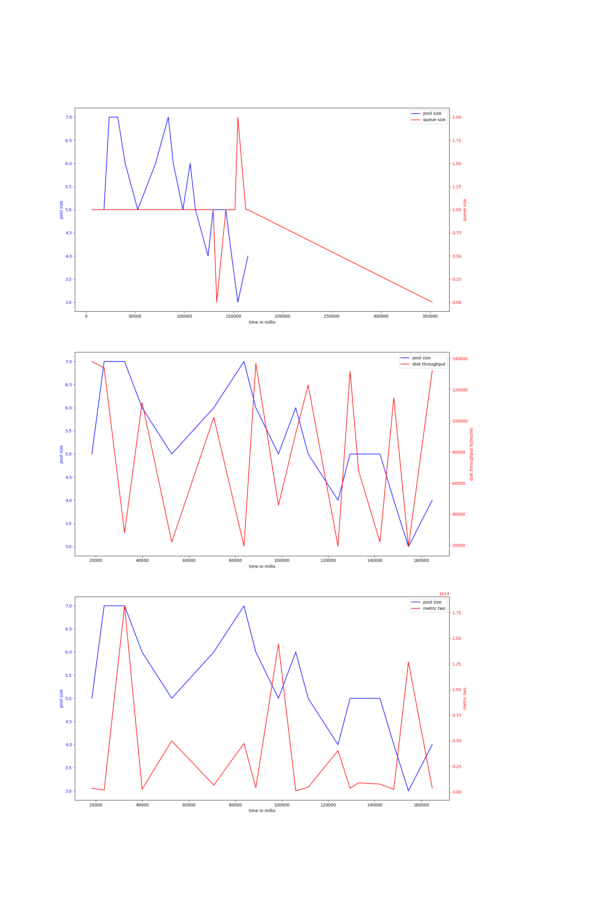{ width=100% }
avg pool size: 5.277777777777778

#### v-3-1000,0.95
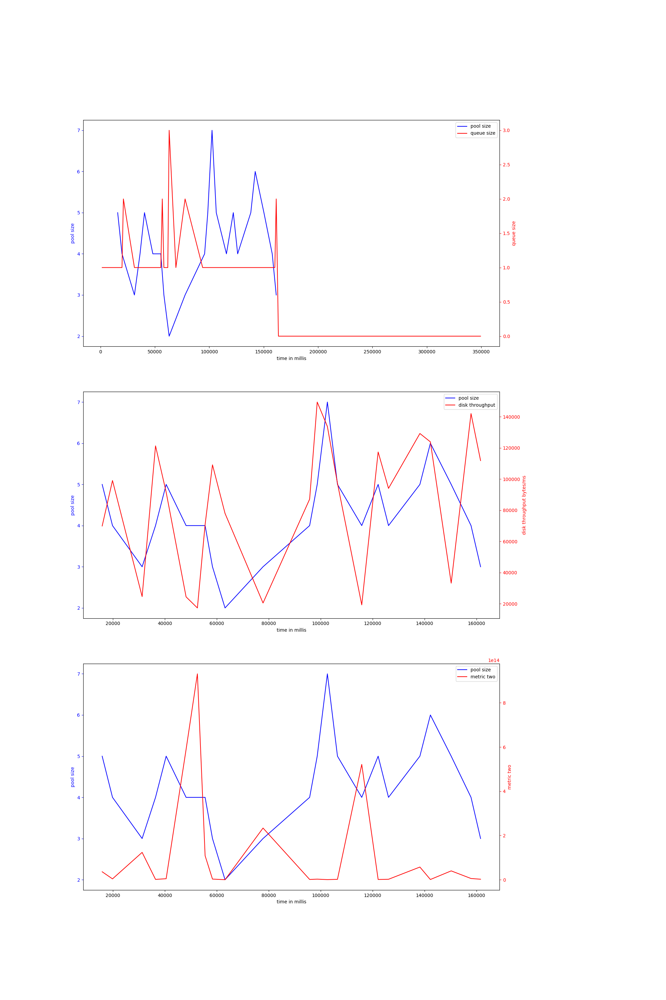{ width=100% }
avg pool size: 4.260869565217392

