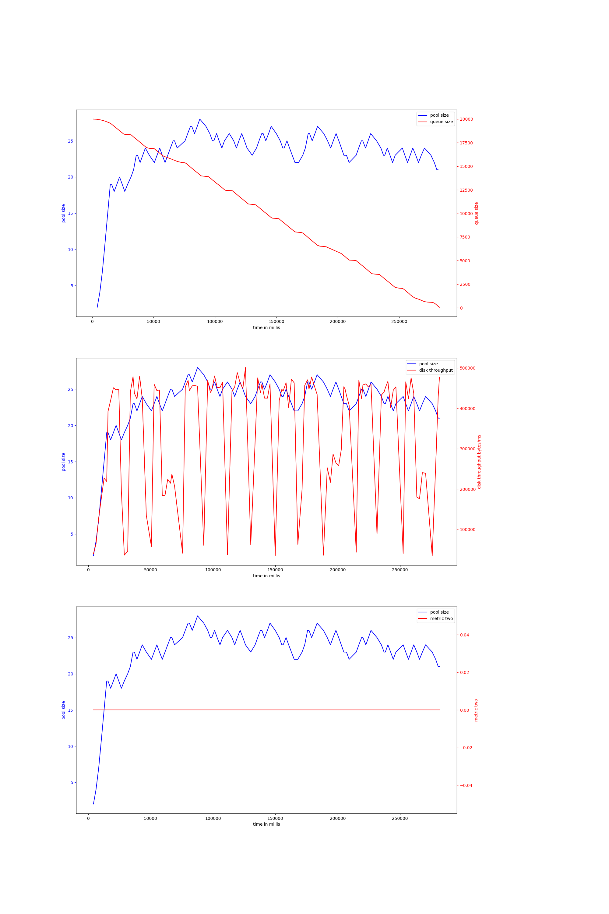
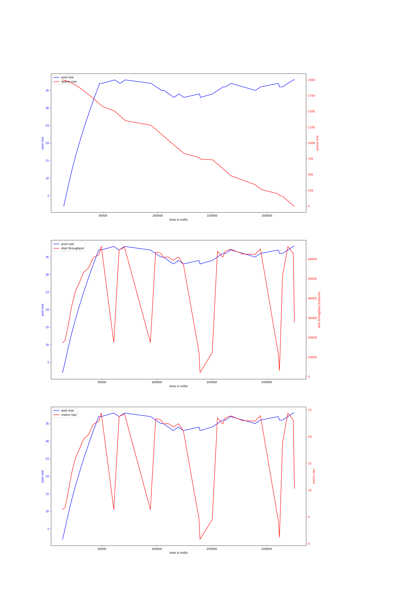

# rust-threadpool-single-phase
## hdd
## ssd
### rw_2mb_oneshot-20000
#### v-2-1000,0.95
{ width=100% }
avg pool size: 14.126760563380282

#### v-2-2000,0.95
{ width=100% }
avg pool size: 16.08433734939759

#### v-2-2000,0.9
{ width=100% }
avg pool size: 12.864864864864865

#### v-2-1000,0.9
{ width=100% }
avg pool size: 23.120689655172413

#### v-4-800,0.97
{ width=100% }
avg pool size: 16.550295857988164

#### v-4-1000,0.9
{ width=100% }
avg pool size: 6.896797153024911

#### v-4-1500,0.9
{ width=100% }
avg pool size: 14.25925925925926

#### v-4-1000,0.95
{ width=100% }
avg pool size: 14.248175182481752

#### v-4-800,0.93
{ width=100% }
avg pool size: 16.956375838926174

#### v-4-1500,0.95
{ width=100% }
avg pool size: 14.665116279069768

#### v-4b-1000,0.9
{ width=100% }
avg pool size: 14.669683257918551

#### v-4b-800,0.93
{ width=100% }
avg pool size: 20.064308681672024

#### v-4b-1500,0.95
{ width=100% }
avg pool size: 10.638743455497382

#### v-4b-1000,0.95
{ width=100% }
avg pool size: 13.901639344262295

#### v-4b-1500,0.9
{ width=100% }
avg pool size: 7.696261682242991

#### v-4b-800,0.97
{ width=100% }
avg pool size: 31.303846153846155

### rw_buf_2mb_oneshot-2000
#### v-2-1000,0.95
{ width=100% }
avg pool size: 23.434782608695652

#### v-2-2000,0.95
{ width=100% }
avg pool size: 28.96875

#### v-2-2000,0.9
{ width=100% }
avg pool size: 24.13157894736842

#### v-2-1000,0.9
{ width=100% }
avg pool size: 27.05128205128205

#### v-4-800,0.97
{ width=100% }
avg pool size: 31.36842105263158

#### v-4-1000,0.9
{ width=100% }
avg pool size: 12.383720930232558

#### v-4-1500,0.9
{ width=100% }
avg pool size: 20.40740740740741

#### v-4-1000,0.95
{ width=100% }
avg pool size: 32.21212121212121

#### v-4-1500,0.95
{ width=100% }
avg pool size: 21.9375

#### v-4-800,0.93
{ width=100% }
avg pool size: 29.102564102564102

#### v-4b-1000,0.95
{ width=100% }
avg pool size: 31.34285714285714

#### v-4b-1500,0.95
{ width=100% }
avg pool size: 23.083333333333332

#### v-4b-1000,0.9
{ width=100% }
avg pool size: 17.55

#### v-4b-1500,0.9
{ width=100% }
avg pool size: 12.093023255813954

#### v-4b-800,0.97
{ width=100% }
avg pool size: 26.585365853658537

#### v-4b-800,0.93
{ width=100% }
avg pool size: 11.227722772277227

