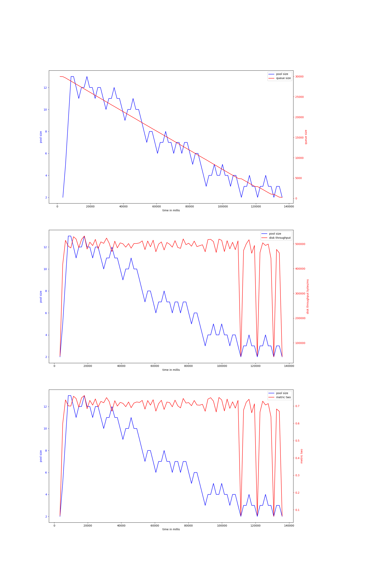

# rust-threadpool-single-phase
## hdd
## ssd
### read_2mb_oneshot-30000
#### v-2-1000,0.9
{ width=100% }
avg pool size: 11.171875

#### v-2-2000,0.9
{ width=100% }
avg pool size: 10.393939393939394

#### v-2-1000,0.95
{ width=100% }
avg pool size: 11.723076923076922

#### v-2-2000,0.95
{ width=100% }
avg pool size: 10.529411764705882

#### v-4-1500,0.9
{ width=100% }
avg pool size: 4.064516129032258

#### v-4-1500,0.95
{ width=100% }
avg pool size: 6.951807228915663

#### v-4-800,0.93
{ width=100% }
avg pool size: 4.637426900584796

#### v-4-800,0.97
{ width=100% }
avg pool size: 4.502923976608187

#### v-4-1000,0.9
{ width=100% }
avg pool size: 4.931034482758621

#### v-4-1000,0.95
{ width=100% }
avg pool size: 6.21969696969697

#### v-4b-800,0.93
{ width=100% }
avg pool size: 5.065934065934066

#### v-4b-1500,0.95
{ width=100% }
avg pool size: 5.952941176470588

#### v-4b-1500,0.9
{ width=100% }
avg pool size: 6.902439024390244

#### v-4b-1000,0.9
{ width=100% }
avg pool size: 4.598639455782313

#### v-4b-1000,0.95
{ width=100% }
avg pool size: 3.595890410958904

#### v-4b-800,0.97
{ width=100% }
avg pool size: 3.962962962962963

