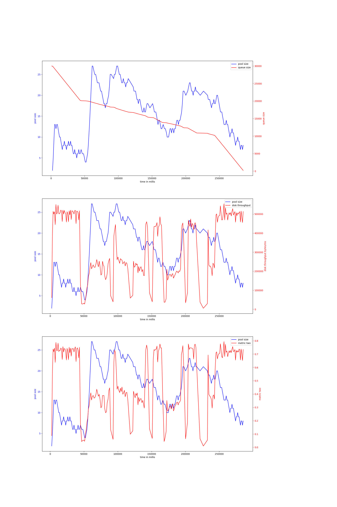

# rust-threadpool-multi-phase
## hdd
## ssd
### r_rw_r_2mb_oneshot-30000
#### v-2-1000,0.9
{ width=100% }
avg pool size: 15.238805970149254

#### v-2-1000,0.95
{ width=100% }
avg pool size: 21.88372093023256

#### v-2-2000,0.95
{ width=100% }
avg pool size: 21.129032258064516

#### v-2-2000,0.9
{ width=100% }
avg pool size: 10.390243902439025

#### v-4-1000,0.95
{ width=100% }
avg pool size: 14.542222222222222

#### v-4-1000,0.9
{ width=100% }
avg pool size: 11.360655737704919

#### v-4-1500,0.9
{ width=100% }
avg pool size: 15.06936416184971

#### v-4-800,0.93
{ width=100% }
avg pool size: 12.870588235294118

#### v-4-800,0.97
{ width=100% }
avg pool size: 24.880434782608695

#### v-4-1500,0.95
{ width=100% }
avg pool size: 12.382716049382717

#### v-4b-800,0.97
{ width=100% }
avg pool size: 13.5016077170418

#### v-4b-1500,0.95
{ width=100% }
avg pool size: 15.24223602484472

#### v-4b-1000,0.9
{ width=100% }
avg pool size: 10.737068965517242

#### v-4b-1500,0.9
{ width=100% }
avg pool size: 12.120218579234972

#### v-4b-1000,0.95
{ width=100% }
avg pool size: 15.182222222222222

#### v-4b-800,0.93
{ width=100% }
avg pool size: 10.342679127725857

