# rocks-io-benchmark
## hdd
## ssd
### fillseq-50000000
#### v-4-1000,0.95
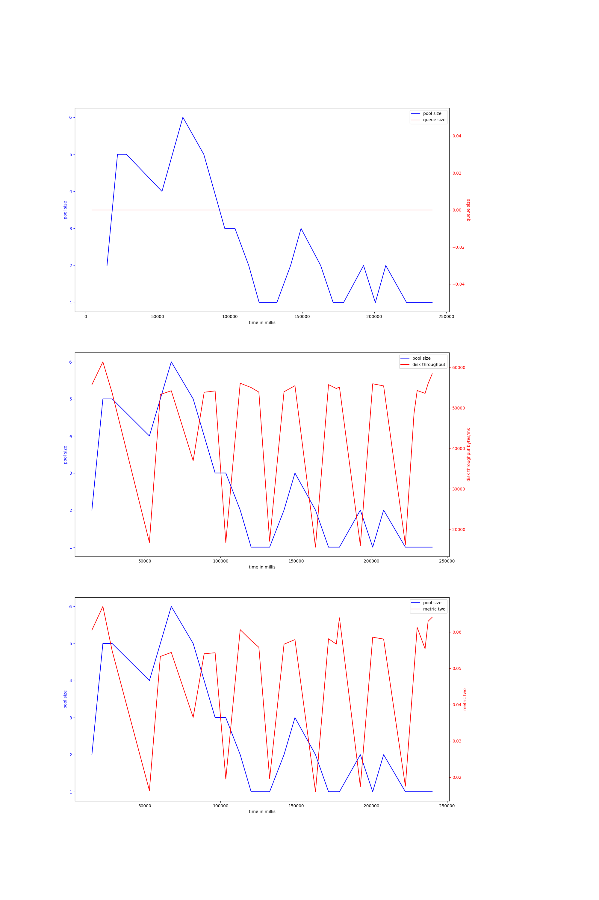{ width=100% }
avg pool size: 2.3448275862068964

#### v-4-1000,0.9
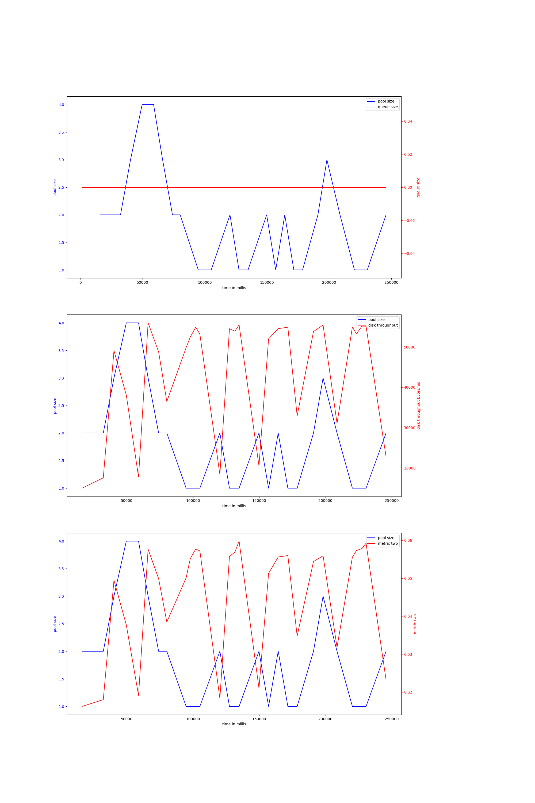{ width=100% }
avg pool size: 1.7586206896551724

#### v-4-1500,0.95
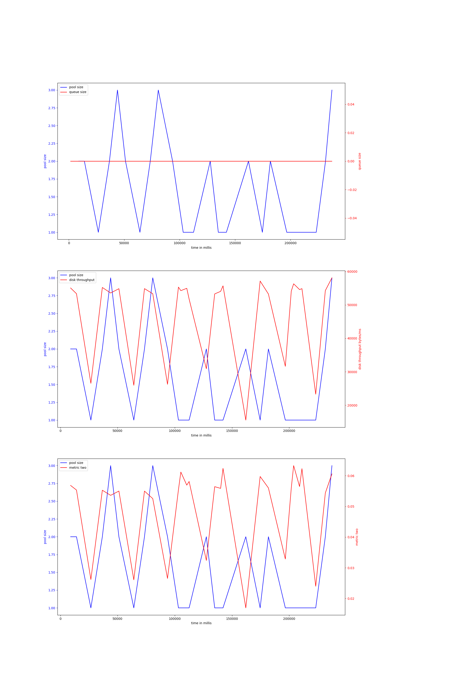{ width=100% }
avg pool size: 1.5517241379310345

#### v-4-1500,0.9
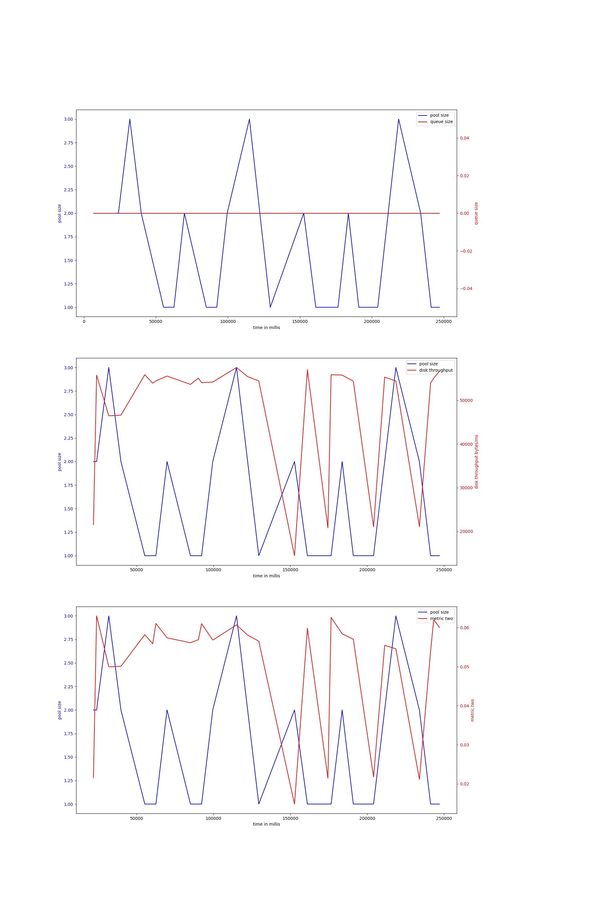{ width=100% }
avg pool size: 1.5714285714285714

#### v-4-800,0.97
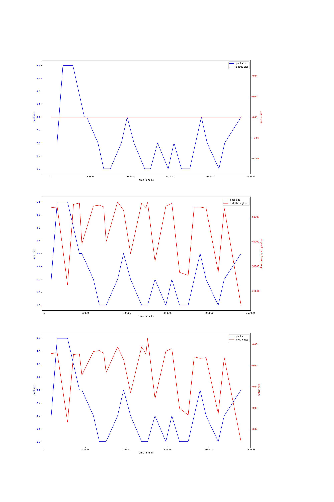{ width=100% }
avg pool size: 2.111111111111111

#### v-4-800,0.93
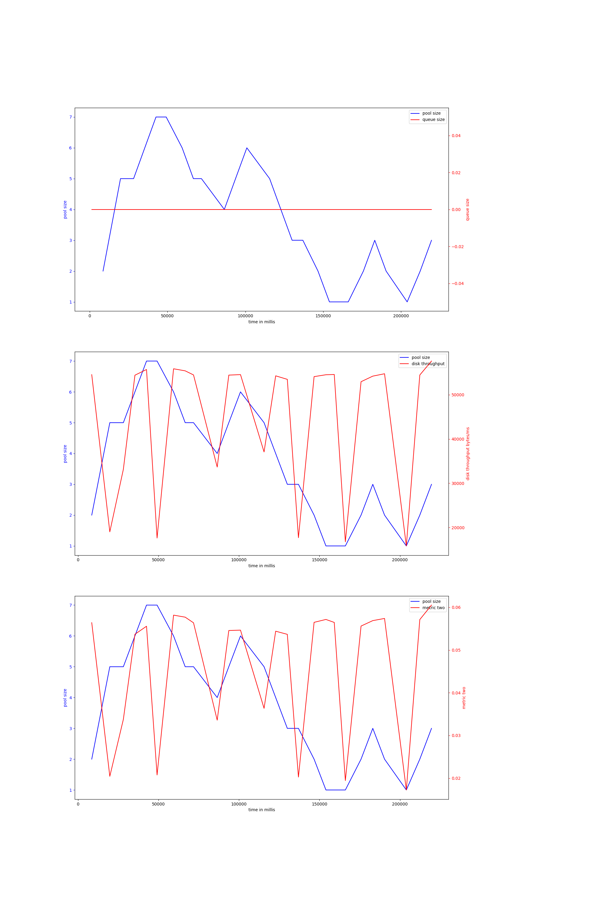{ width=100% }
avg pool size: 3.6923076923076925

#### v-4b-800,0.97
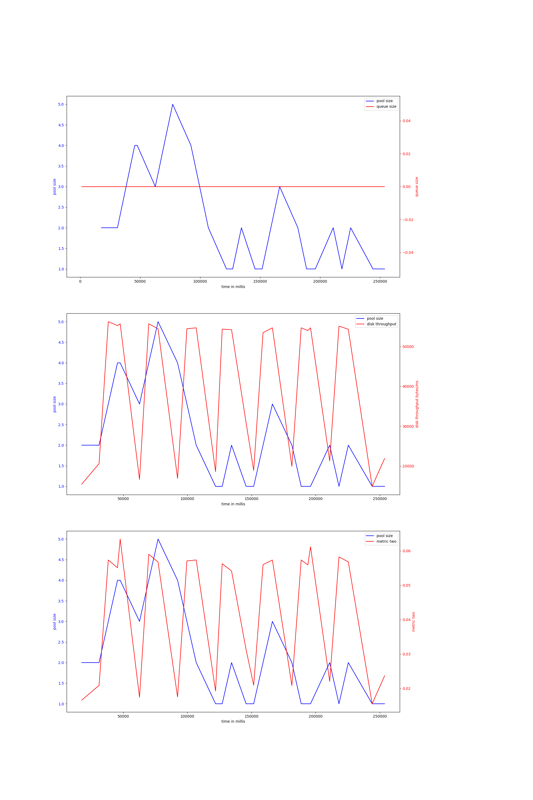{ width=100% }
avg pool size: 2.185185185185185

#### v-4b-800,0.93
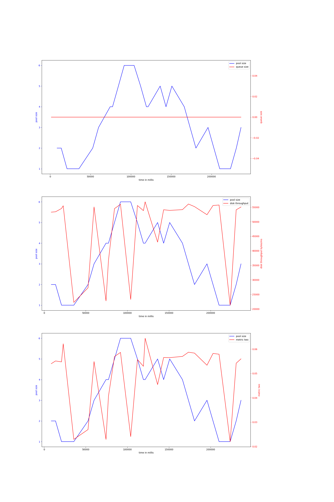{ width=100% }
avg pool size: 3.1481481481481484

#### v-4b-1000,0.9
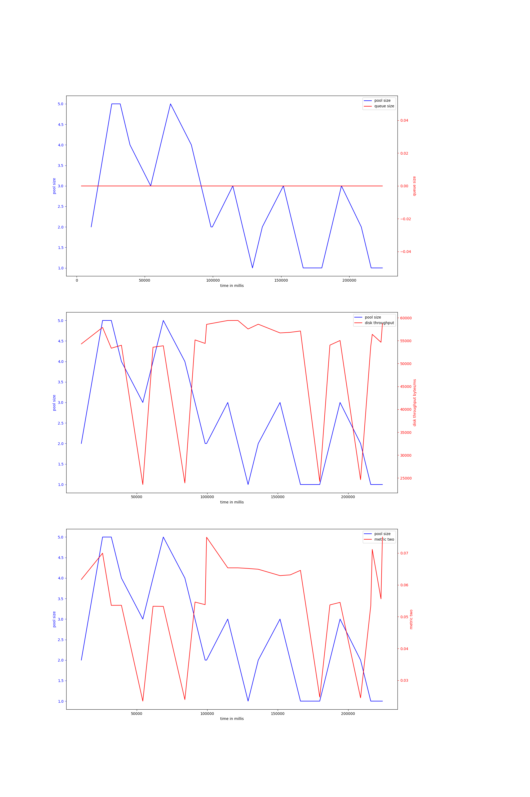{ width=100% }
avg pool size: 2.5

#### v-4b-1500,0.95
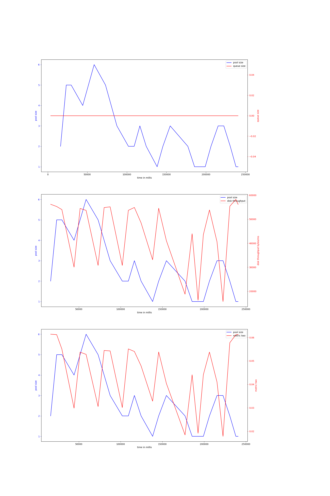{ width=100% }
avg pool size: 2.730769230769231

#### v-4b-1500,0.9
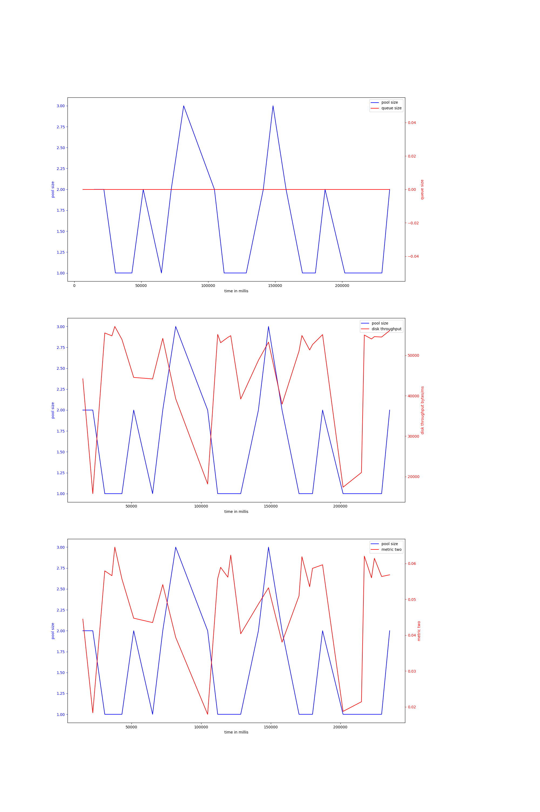{ width=100% }
avg pool size: 1.4193548387096775

#### v-4b-1000,0.95
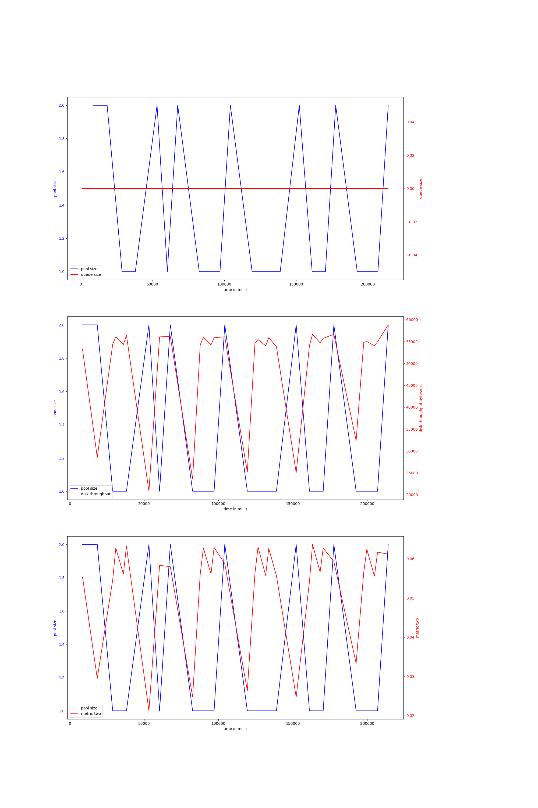{ width=100% }
avg pool size: 1.2424242424242424

