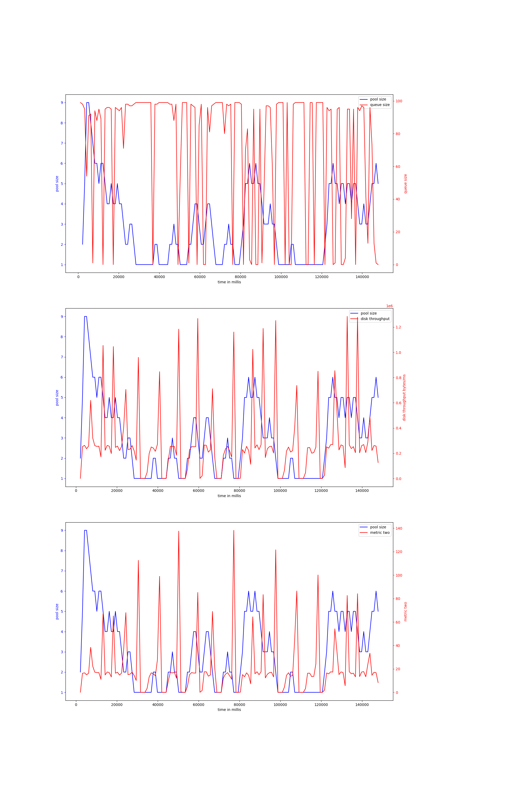
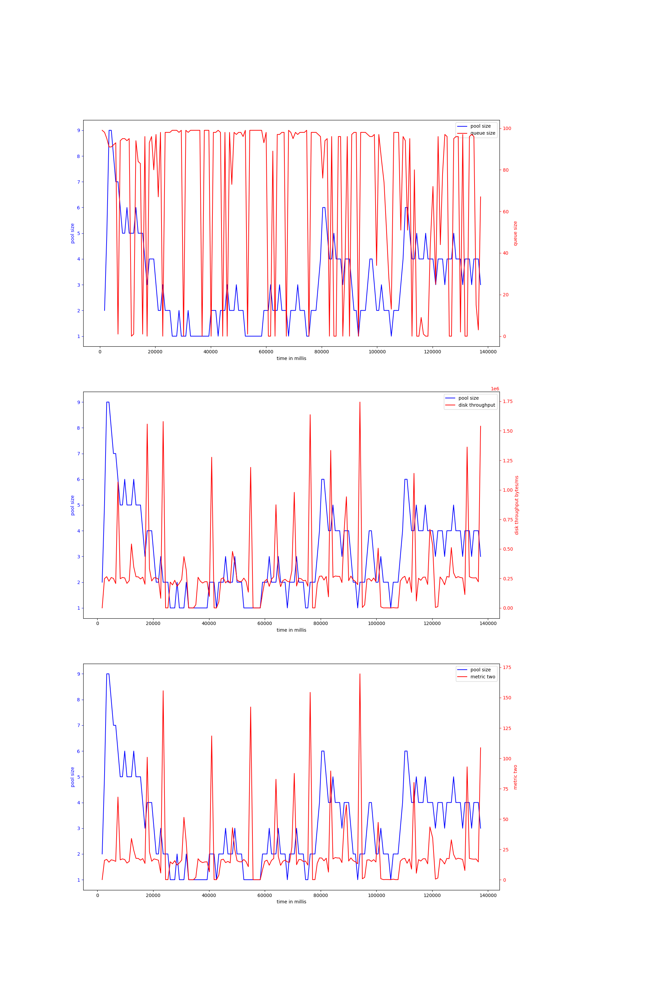
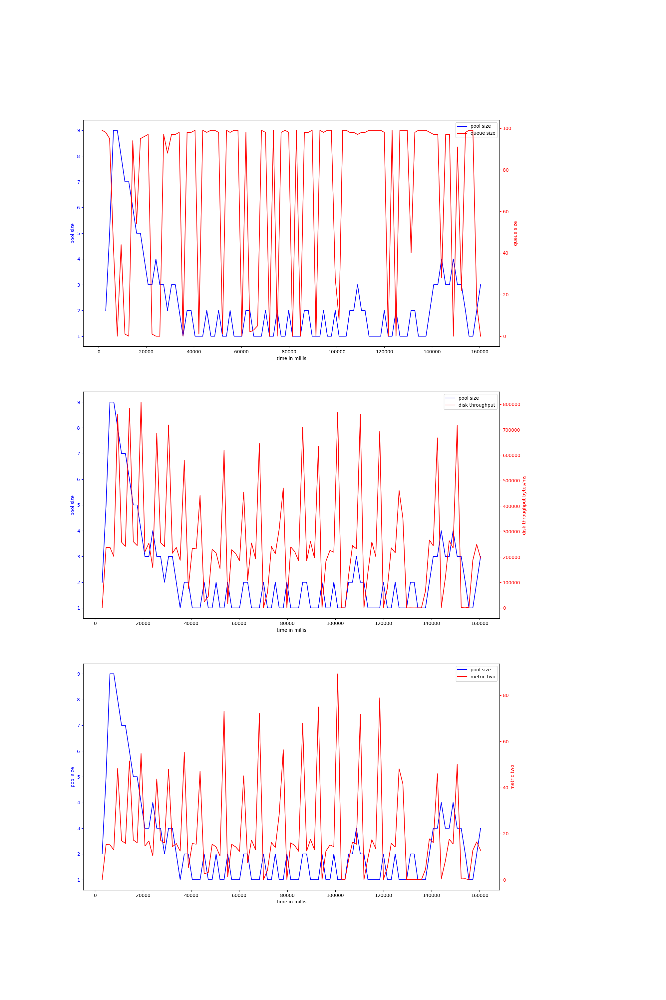
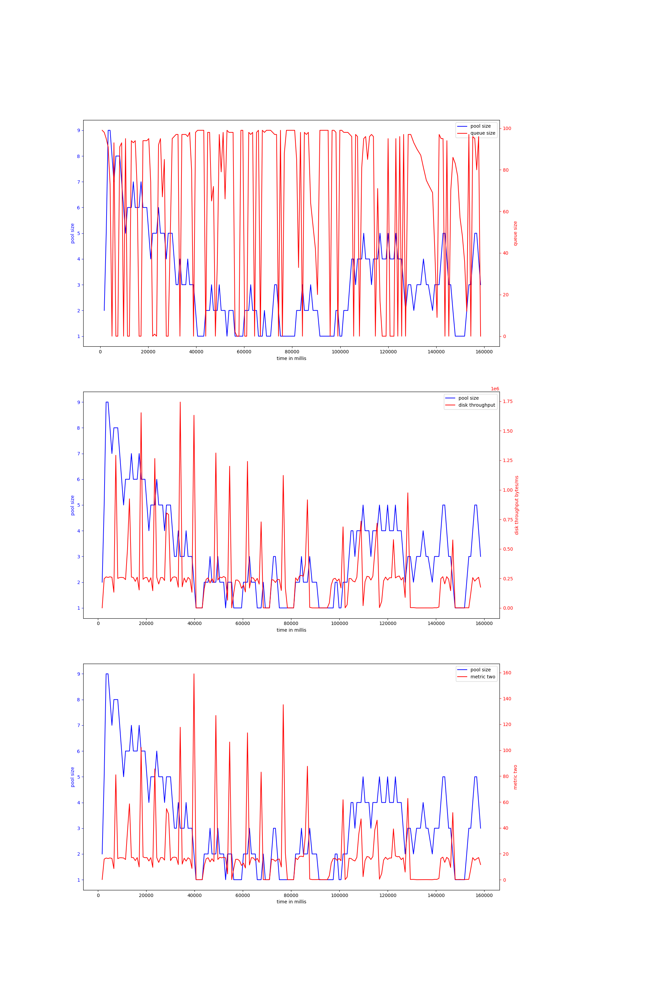
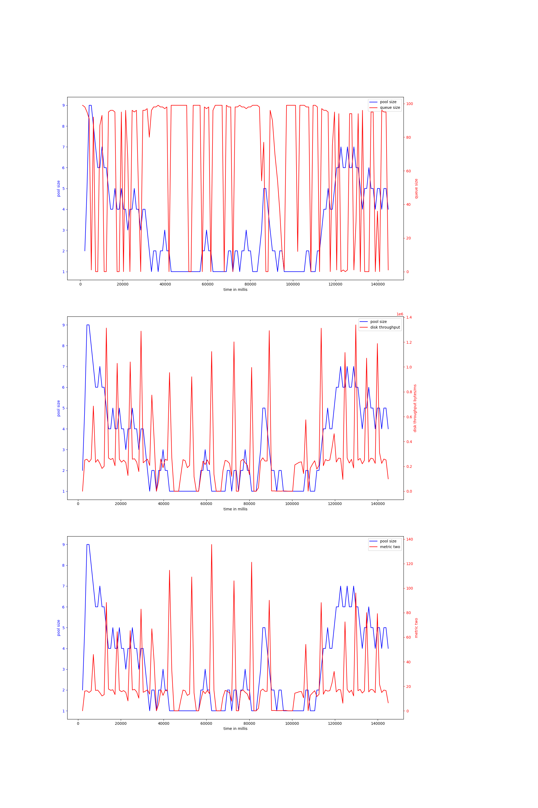
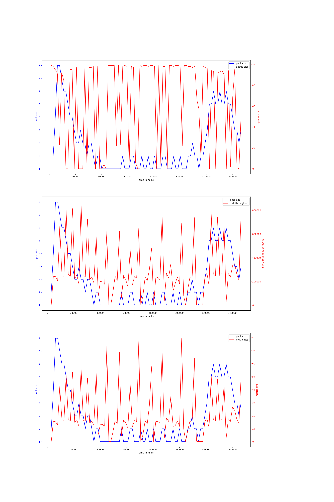

# node-io-benchmark
## hdd
## ssd
### rw_sync_10mb-node-2000
#### v-4-1000,0.95
{ width=100% }
avg pool size: 2.979020979020979

#### v-4-800,0.97
{ width=100% }
avg pool size: 3.036144578313253

#### v-4-1500,0.95
{ width=100% }
avg pool size: 2.2244897959183674

#### v-4-800,0.93
{ width=100% }
avg pool size: 3.1675675675675676

#### v-4-1000,0.9
{ width=100% }
avg pool size: 3.142857142857143

#### v-4-1500,0.9
{ width=100% }
avg pool size: 2.9

