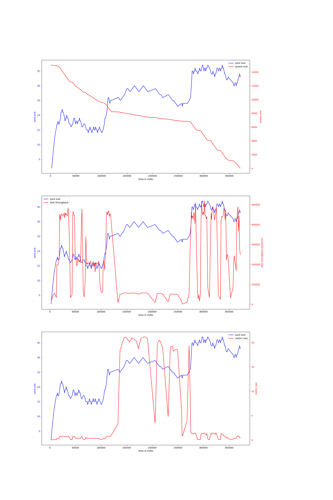
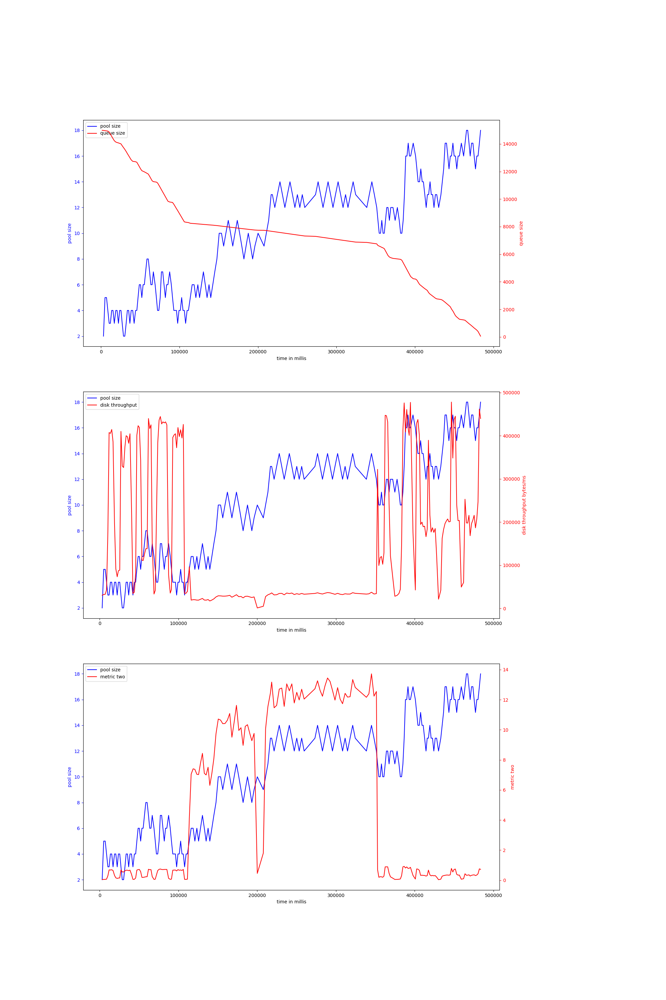
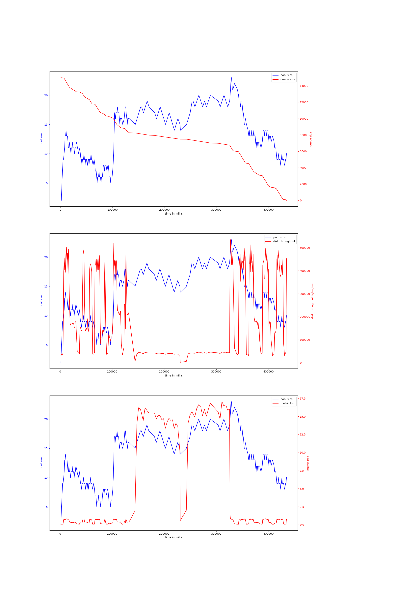
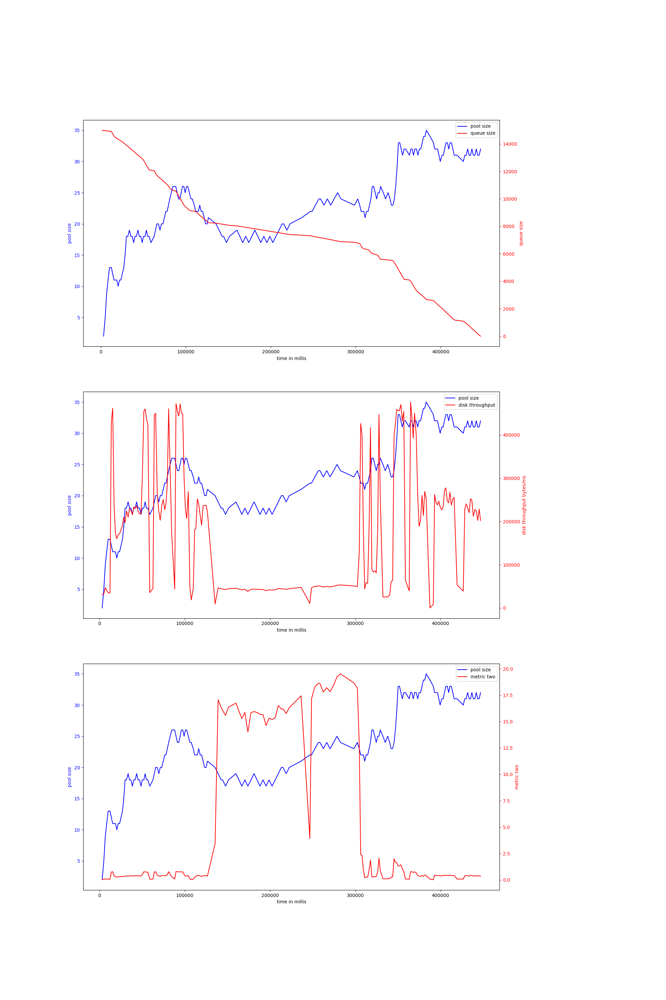
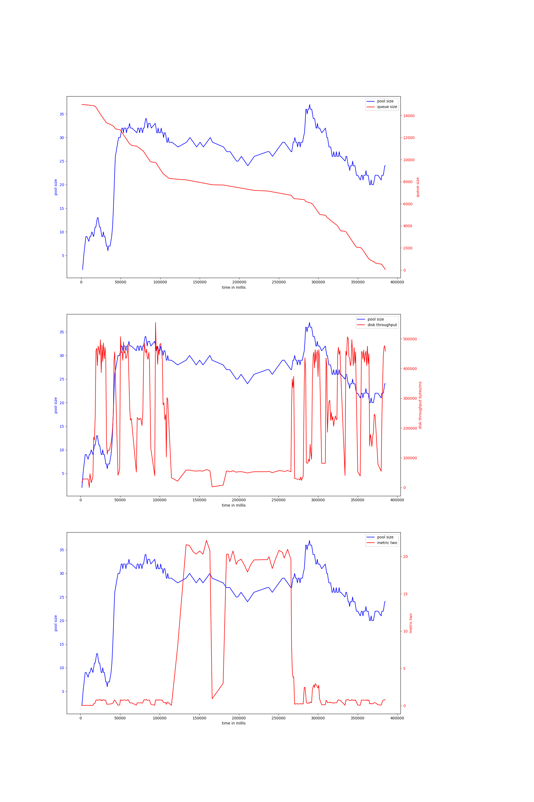
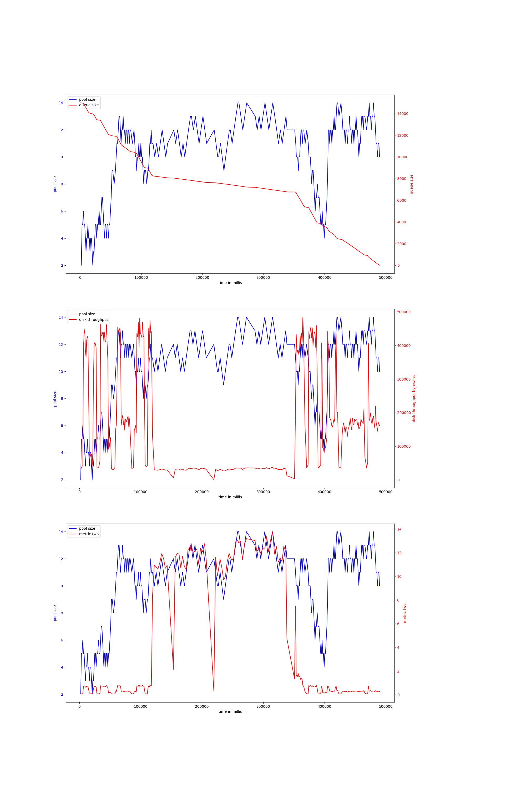

# rust-threadpool-multi-phase
## hdd
## ssd
### rw_rwbuf_rw_2mb_oneshot-15000
#### v-4-1000,0.95
{ width=100% }
avg pool size: 25.20212765957447

#### v-4-1500,0.9
{ width=100% }
avg pool size: 9.981042654028435

#### v-4-800,0.93
{ width=100% }
avg pool size: 12.783269961977187

#### v-4-1500,0.95
{ width=100% }
avg pool size: 23.375

#### v-4-800,0.97
{ width=100% }
avg pool size: 25.333333333333332

#### v-4-1000,0.9
{ width=100% }
avg pool size: 9.963503649635037

