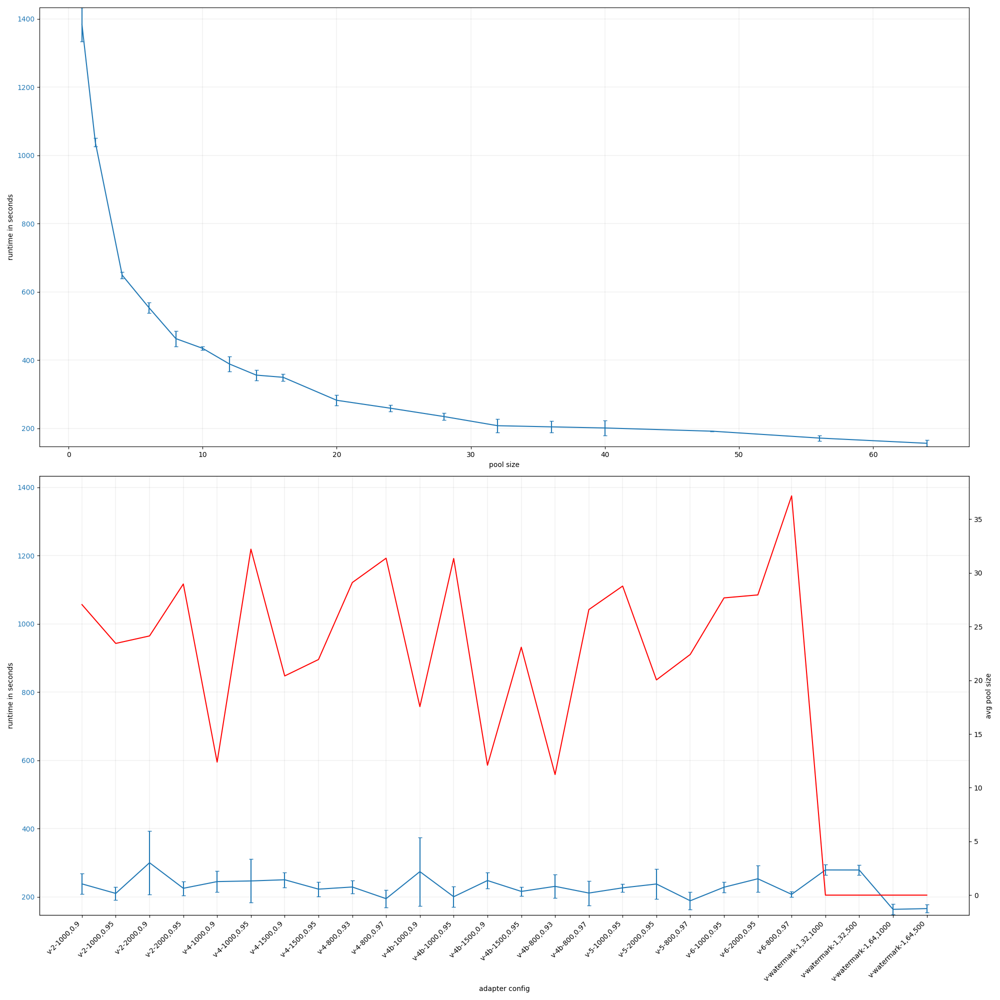

# node-io-benchmark
## ssd
### rw_sync_10mb-node
#### number of items: 2000
{ width=100% }

# rocks-io-benchmark
## ssd
### fillseq
#### number of items: 50000000
{ width=100% }

# rust-threadpool-single-phase
## ssd
### rw_buf_2mb_oneshot
#### number of items: 2000
{ width=100% }

