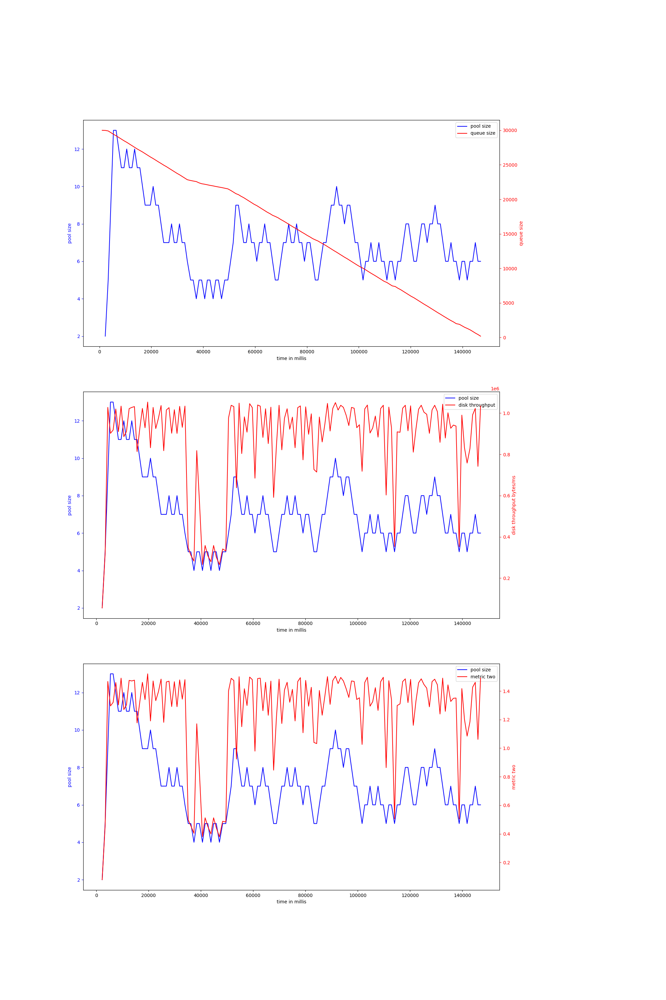
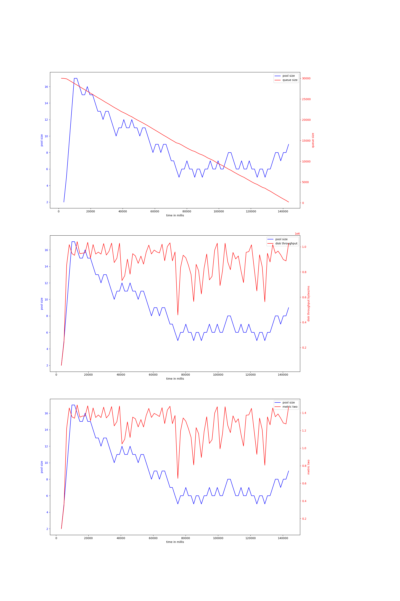
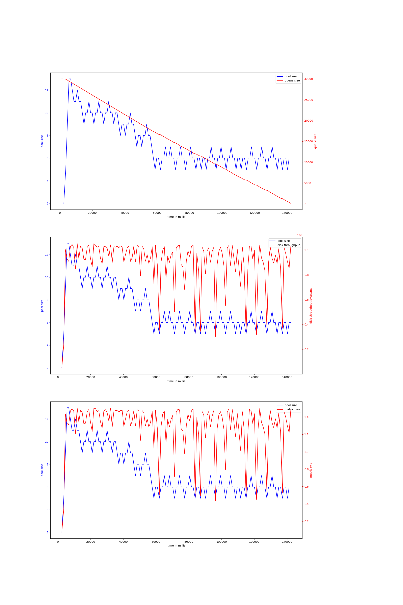
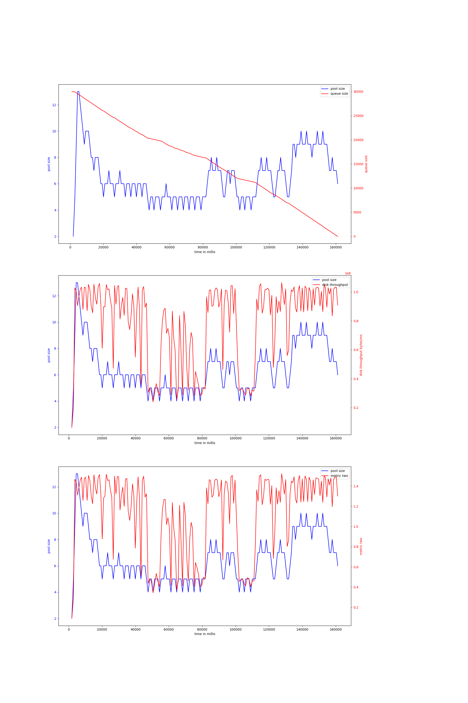
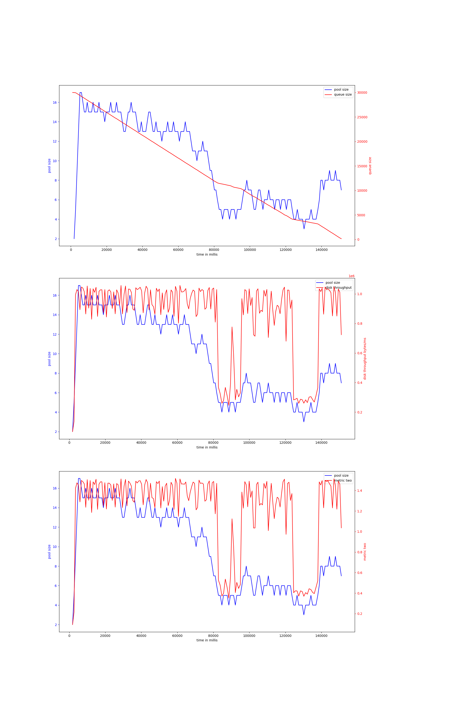
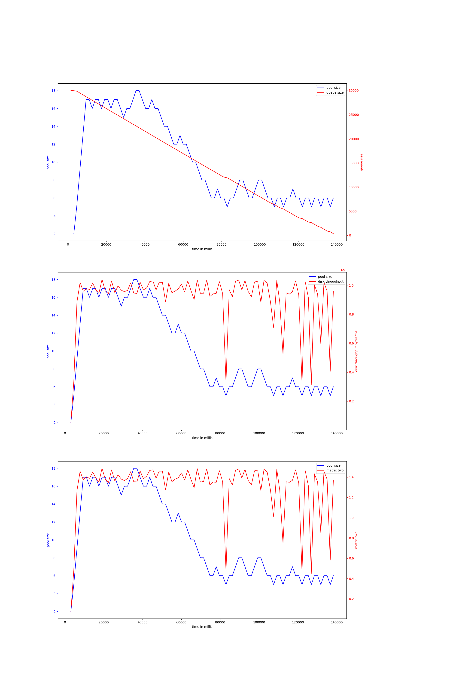

# rust-threadpool-single-phase
## hdd
## ssd
### rw_nosync_2mb_oneshot-30000
#### v-4-1000,0.95
{ width=100% }
avg pool size: 7.148936170212766

#### v-4-1500,0.9
{ width=100% }
avg pool size: 8.781609195402298

#### v-4-1000,0.9
{ width=100% }
avg pool size: 7.272058823529412

#### v-4-800,0.93
{ width=100% }
avg pool size: 6.576719576719577

#### v-4-800,0.97
{ width=100% }
avg pool size: 9.865921787709498

#### v-4-1500,0.95
{ width=100% }
avg pool size: 10.166666666666666

