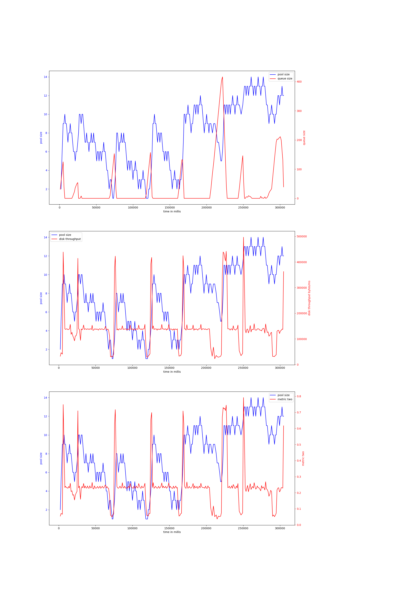

# rust-threadpool-single-phase
## hdd
## ssd
### rw_2mb_every30ms-10000
#### v-4-800,0.93
{ width=100% }
avg pool size: 7.673652694610778

#### v-4-1000,0.9
{ width=100% }
avg pool size: 5.552238805970149

#### v-4-1000,0.95
{ width=100% }
avg pool size: 7.768382352941177

#### v-4-1500,0.95
{ width=100% }
avg pool size: 9.033333333333333

#### v-4-800,0.97
{ width=100% }
avg pool size: 10.566666666666666

#### v-4-1500,0.9
{ width=100% }
avg pool size: 8.078212290502794

