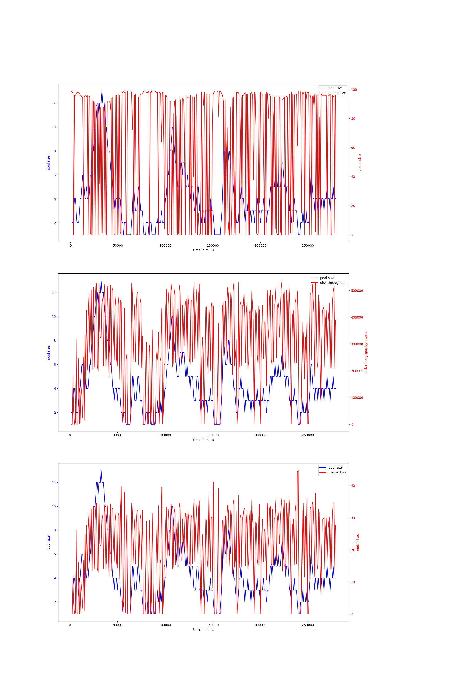

# node-io-benchmark
## hdd
## ssd
### rw_nosync_2mb-node-20000
#### v-4-1000,0.9
{ width=100% }
avg pool size: 3.66996699669967

#### v-4-800,0.93
{ width=100% }
avg pool size: 5.304347826086956

#### v-4-800,0.97
{ width=100% }
avg pool size: 4.229411764705882

#### v-4-1500,0.95
{ width=100% }
avg pool size: 4.735483870967742

#### v-4-1500,0.9
{ width=100% }
avg pool size: 3.838150289017341

#### v-4-1000,0.95
{ width=100% }
avg pool size: 5.0546875

