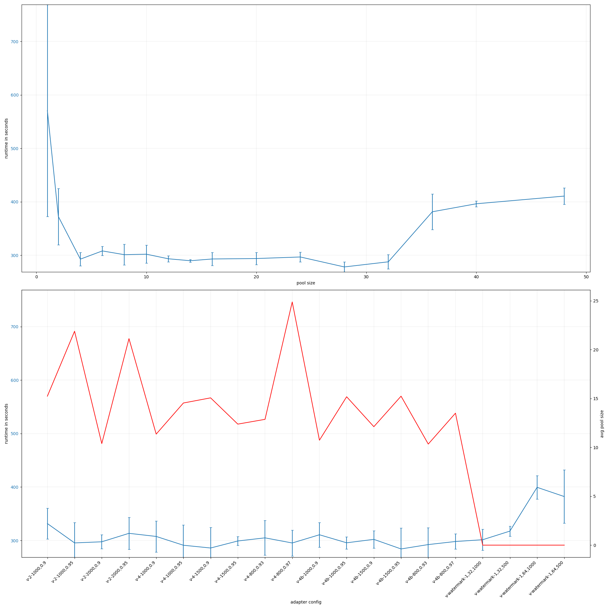
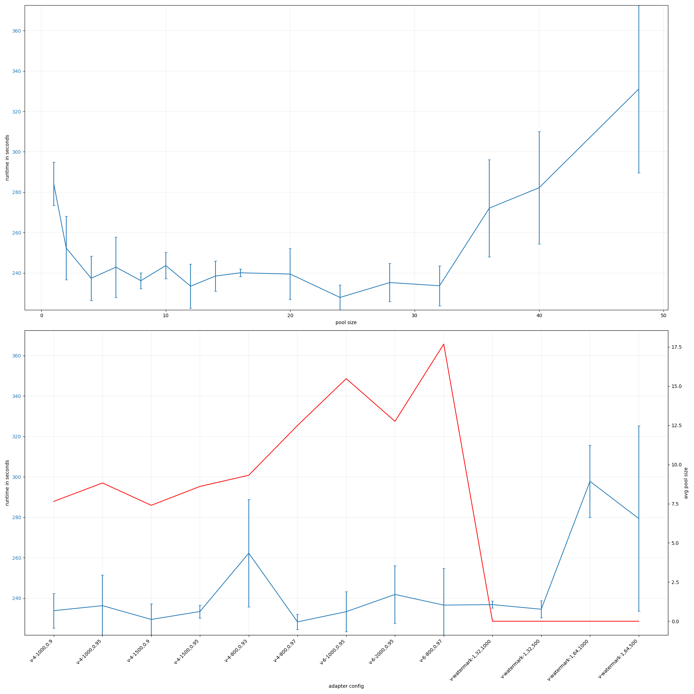
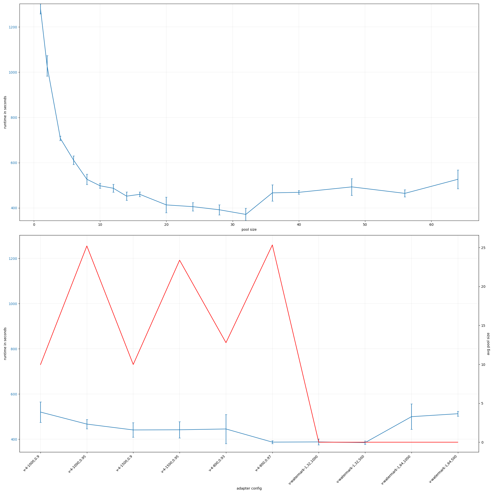
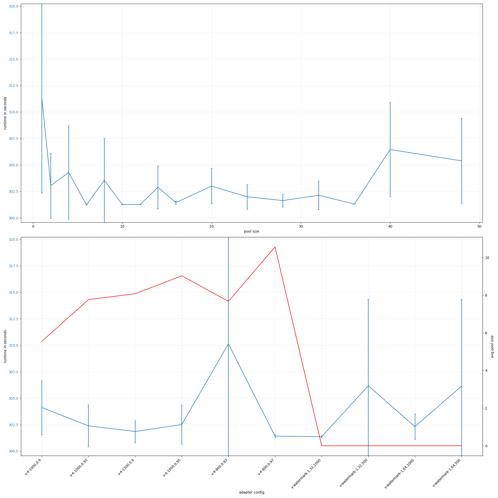
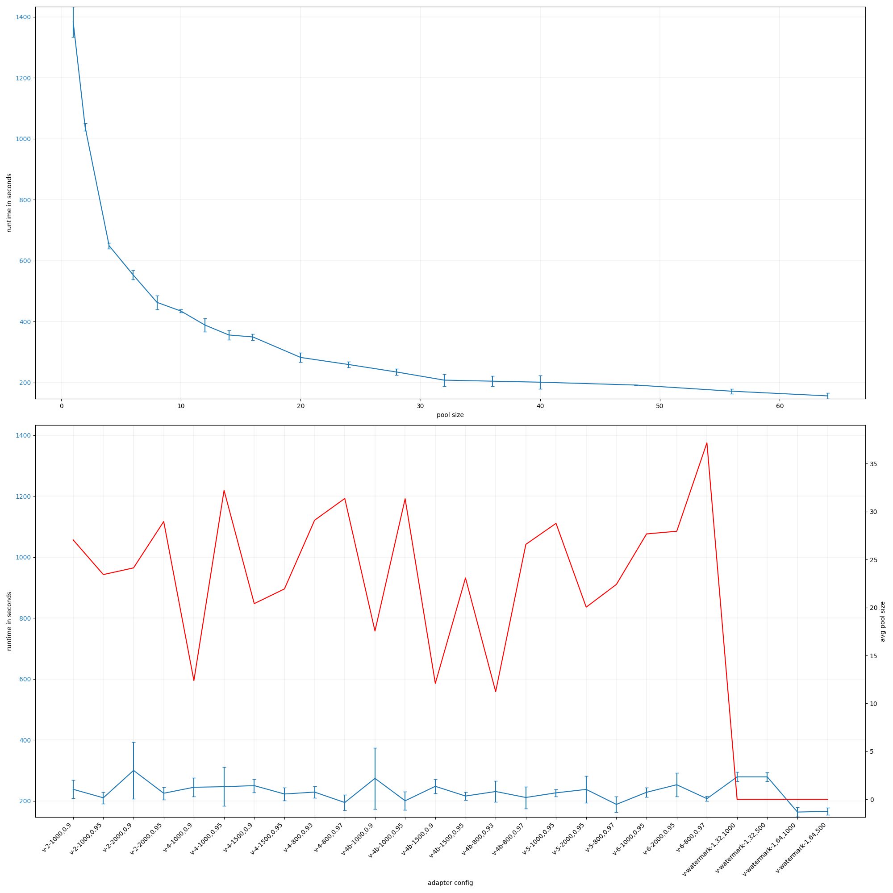
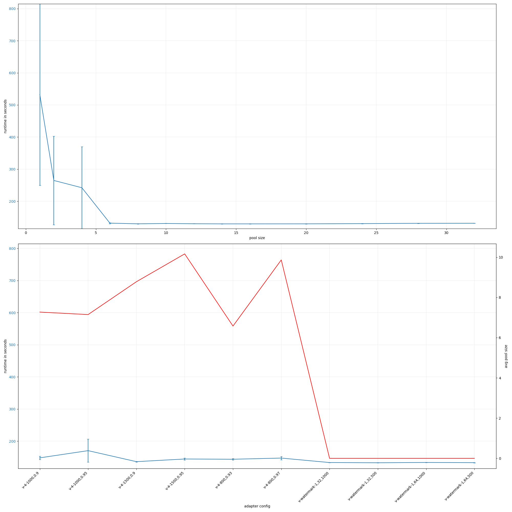

# rust-threadpool-multi-phase
## ssd
### r_rw_r_2mb_oneshot
#### number of items: 30000
{ width=100% }

### rw2mb_30ms_oneshot
#### number of items: 10000
{ width=100% }

### rw_rwbuf_rw_2mb_oneshot
#### number of items: 15000
{ width=100% }

# rust-threadpool-single-phase
## ssd
### rw_2mb_every30ms
#### number of items: 10000
{ width=100% }

### rw_buf_2mb_oneshot
#### number of items: 2000
{ width=100% }

### rw_nosync_2mb_oneshot
#### number of items: 30000
{ width=100% }

