# rust-threadpool-single-phase
## hdd
## ssd
### rw_nosync_2mb_oneshot-30000
#### v-6-2000,0.95
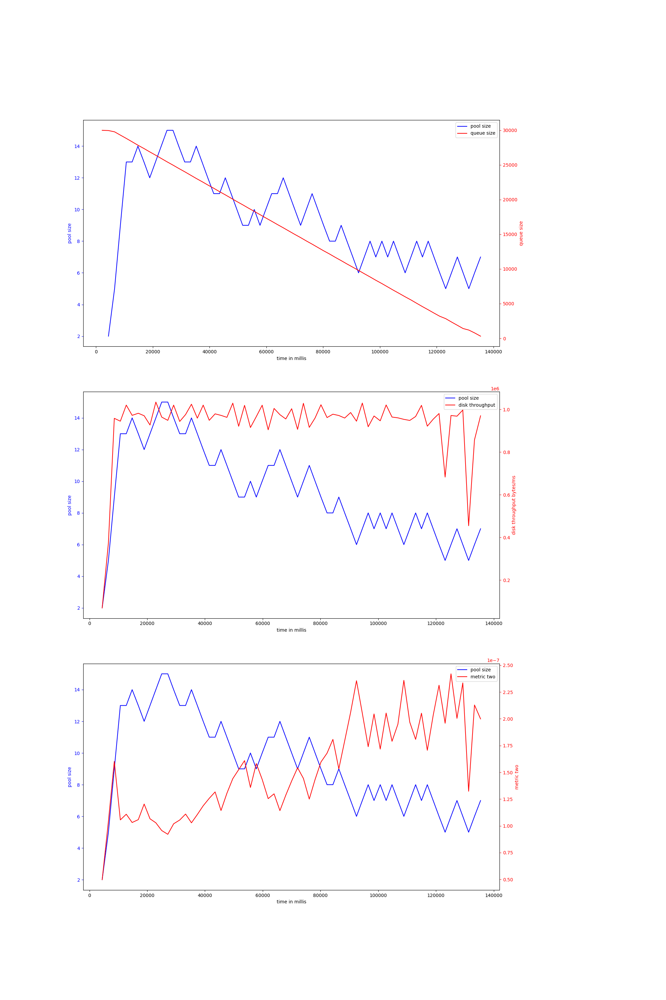{ width=100% }
avg pool size: 9.415384615384616

#### v-6-1000,0.95
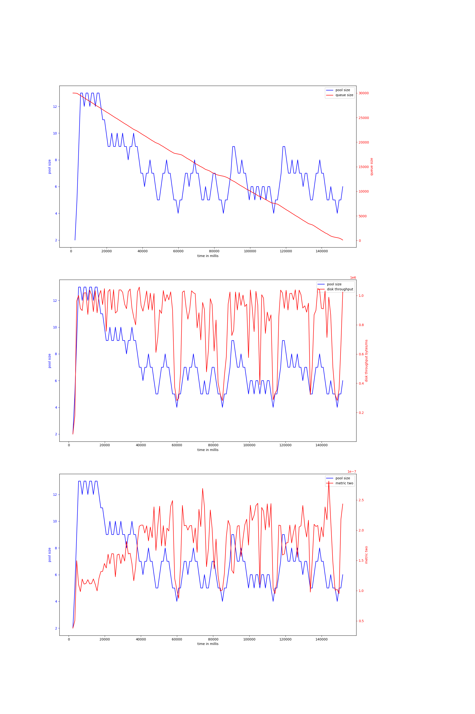{ width=100% }
avg pool size: 7.220689655172414

#### v-6-800,0.97
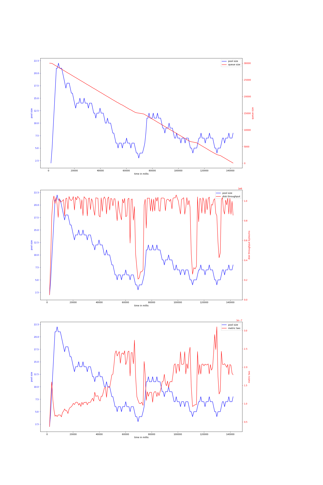{ width=100% }
avg pool size: 9.494117647058824

# rocks-io-benchmark
## hdd
## ssd
### fillseq-50000000
#### v-4-800,0.97
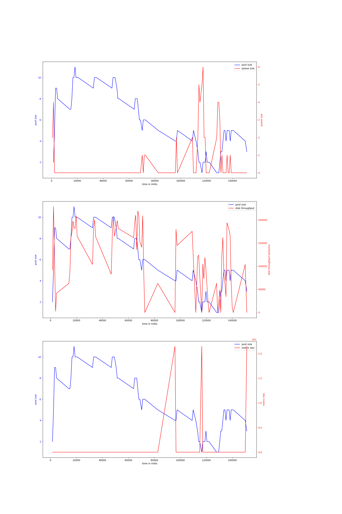{ width=100% }
avg pool size: 5.698630136986301

#### v-4-1500,0.9
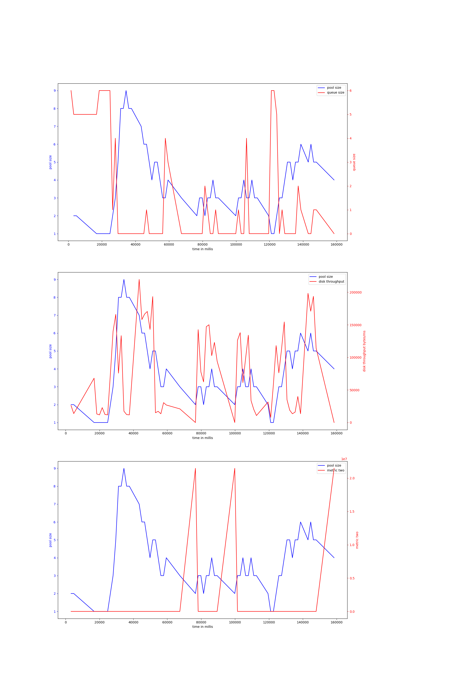{ width=100% }
avg pool size: 3.765625

#### v-4-1000,0.95
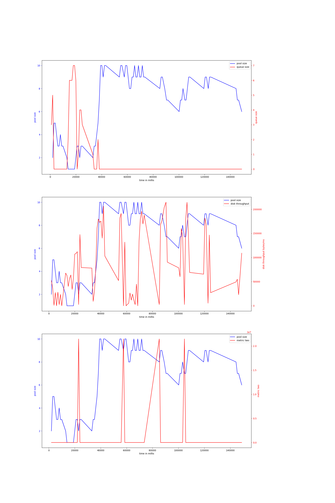{ width=100% }
avg pool size: 6.538461538461538

#### v-4-1500,0.95
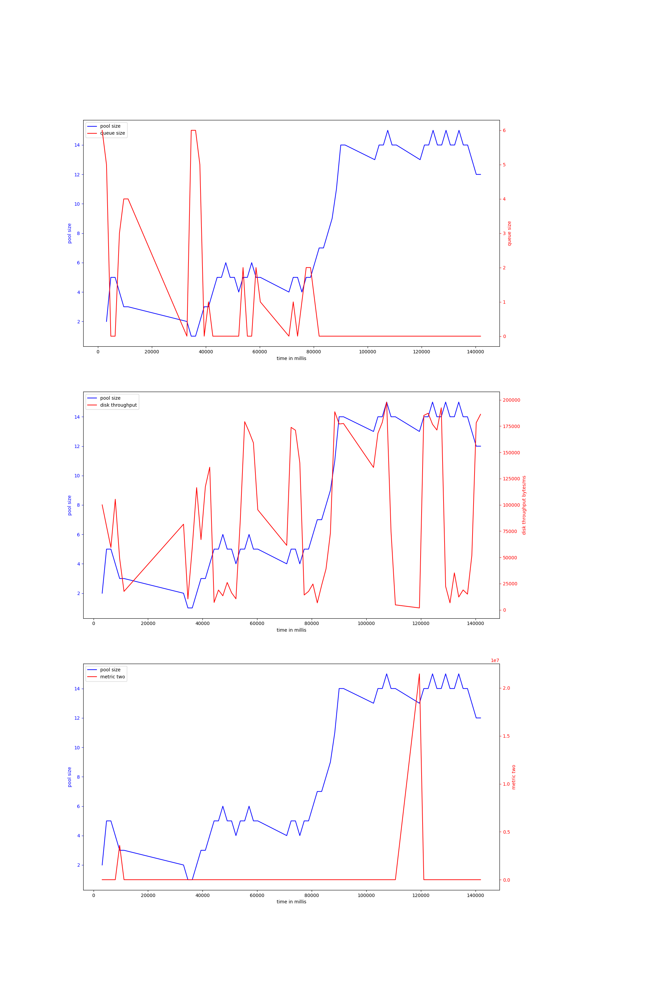{ width=100% }
avg pool size: 8.288135593220339

#### v-4-1000,0.9
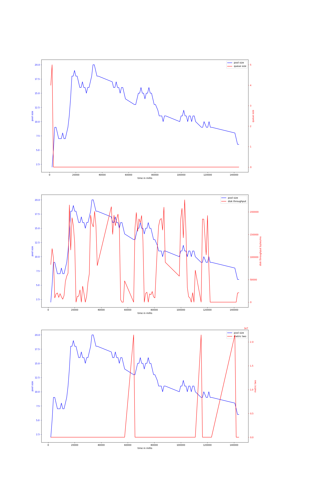{ width=100% }
avg pool size: 12.729166666666666

#### v-6-1000,0.95
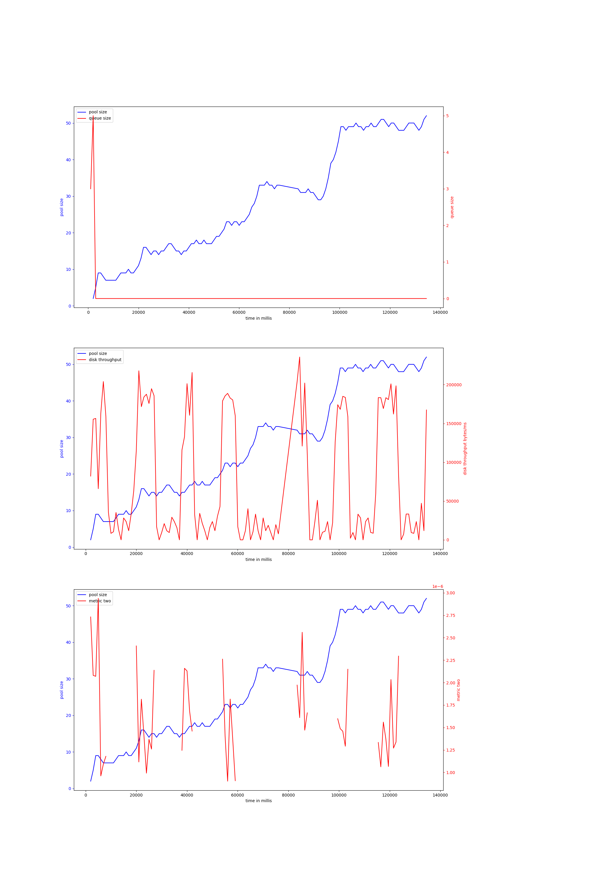{ width=100% }
avg pool size: 28.488188976377952

#### v-6-2000,0.95
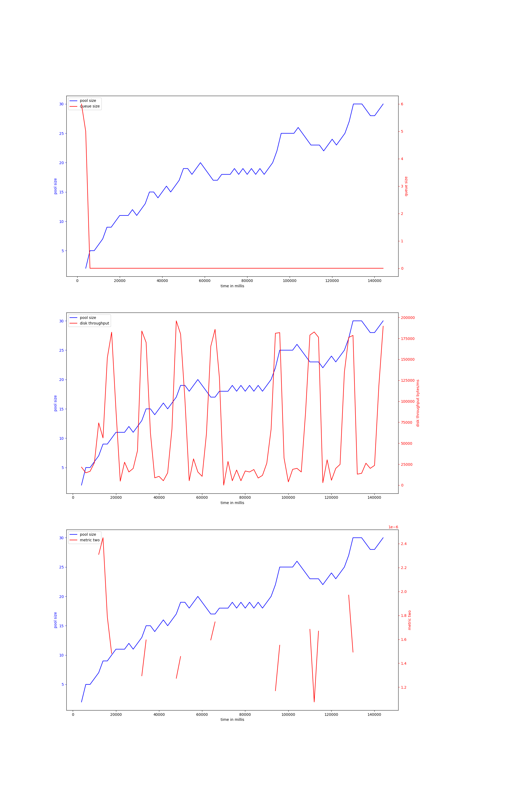{ width=100% }
avg pool size: 18.760563380281692

#### v-6-800,0.97
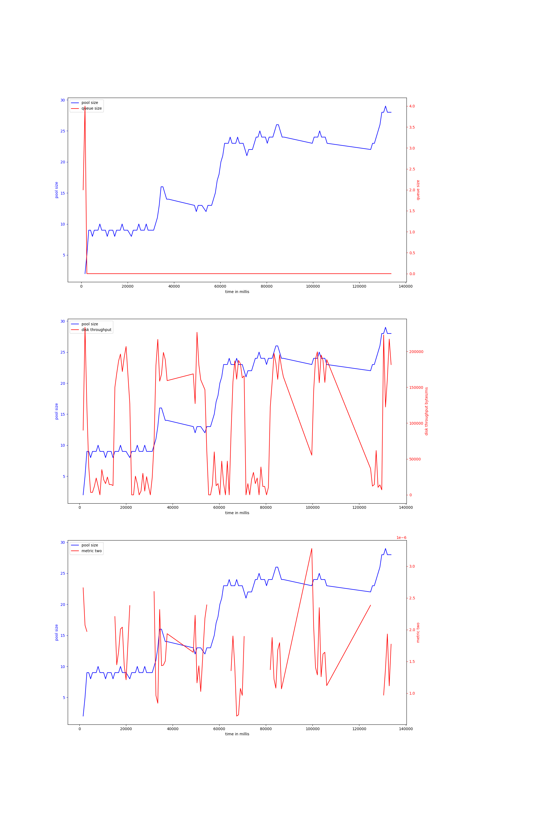{ width=100% }
avg pool size: 17.149122807017545

