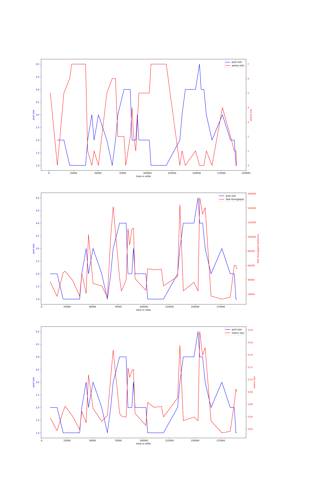
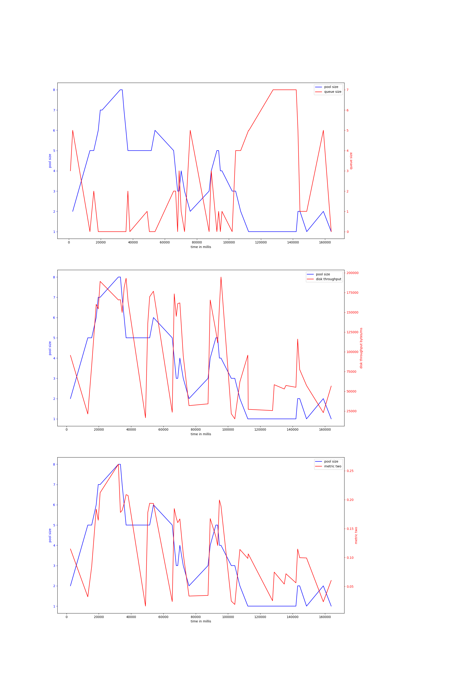
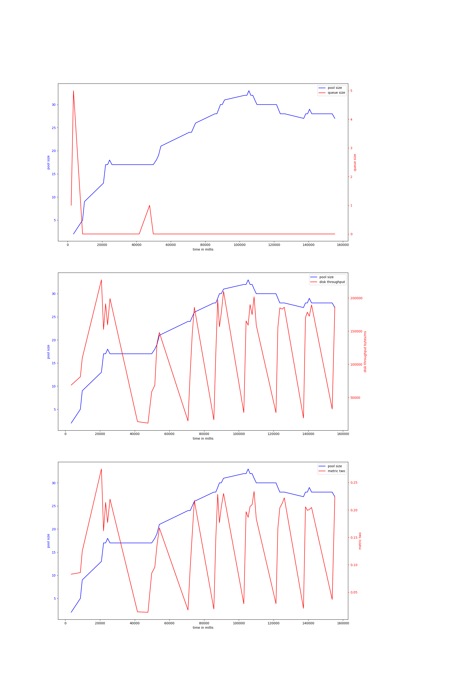
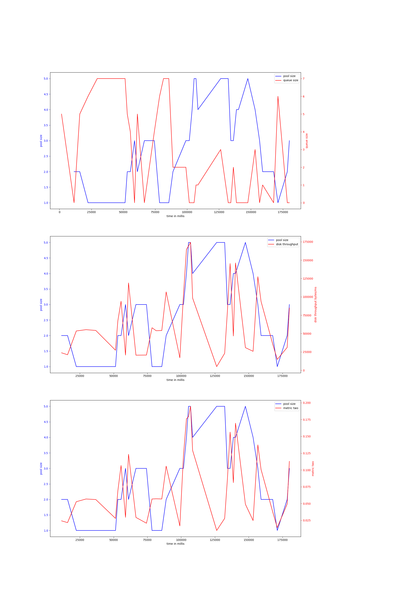
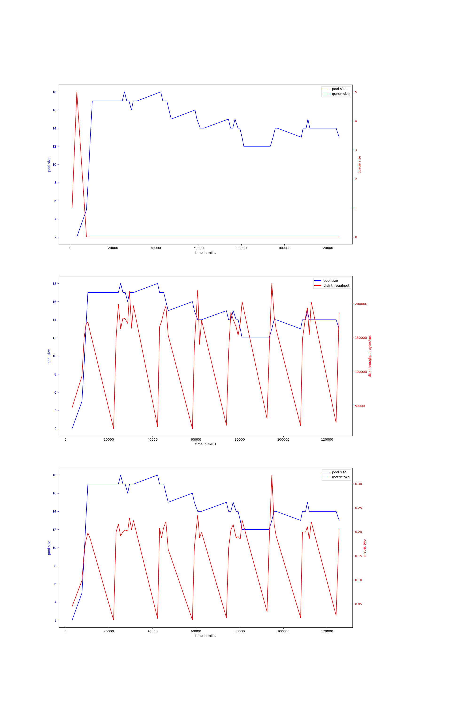

# rocks-io-benchmark
## hdd
## ssd
### fillseq-50000000
#### v-4-1500,0.95
{ width=100% }
avg pool size: 2.317073170731707

#### v-4-1000,0.9
{ width=100% }
avg pool size: 3.727272727272727

#### v-4-1000,0.95
{ width=100% }
avg pool size: 24.232558139534884

#### v-4-1500,0.9
{ width=100% }
avg pool size: 2.7222222222222223

#### v-4-800,0.97
{ width=100% }
avg pool size: 14.4375

