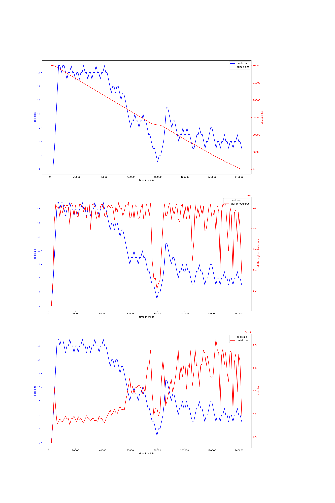

# rust-threadpool-single-phase
## hdd
## ssd
### rw_nosync_2mb_oneshot-30000
#### v-6-2000,0.97
{ width=100% }
avg pool size: 18.0

#### v-6-500,0.97
{ width=100% }
avg pool size: 10.097222222222221

#### v-6-1000,0.97
{ width=100% }
avg pool size: 8.75187969924812

#### v-6-2000,0.9
{ width=100% }
avg pool size: 7.731343283582089

#### v-6-1000,0.9
{ width=100% }
avg pool size: 10.036764705882353

#### v-6-1500,0.97
{ width=100% }
avg pool size: 9.522222222222222

#### v-6-1500,0.9
{ width=100% }
avg pool size: 12.725

