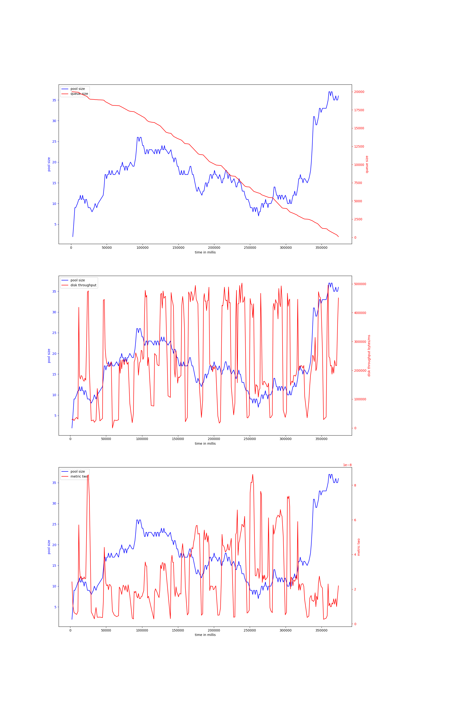

# rust-threadpool-single-phase
## hdd
## ssd
### rw_2mb_oneshot-20000
#### v-6-2000,0.97
{ width=100% }
avg pool size: 27.43452380952381

#### v-6-2000,0.9
{ width=100% }
avg pool size: 13.346666666666666

#### v-6-1000,0.9
{ width=100% }
avg pool size: 16.604743083003953

#### v-6-1500,0.9
{ width=100% }
avg pool size: 8.047169811320755

#### v-6-1000,0.97
{ width=100% }
avg pool size: 17.259124087591243

#### v-6-1500,0.97
{ width=100% }
avg pool size: 18.615

#### v-6-500,0.97
{ width=100% }
avg pool size: 30.112021857923498

#### v-6-2000,0.95
{ width=100% }
avg pool size: 21.992481203007518

