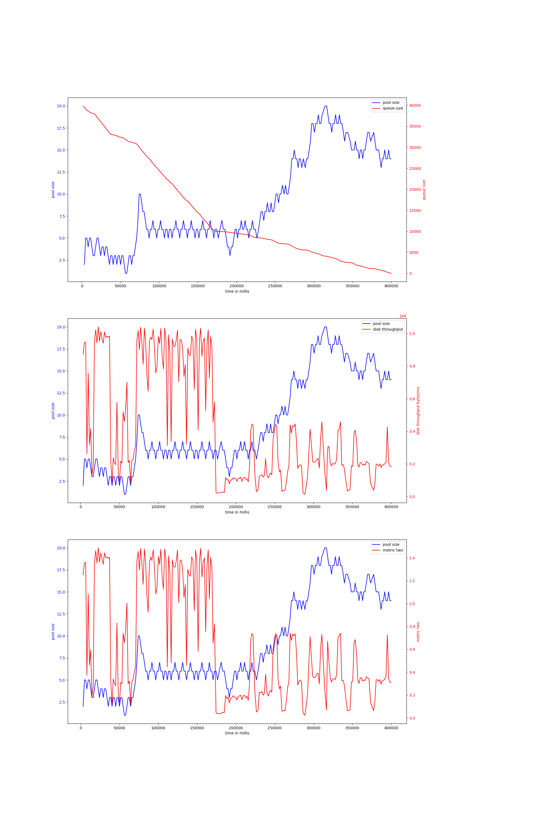
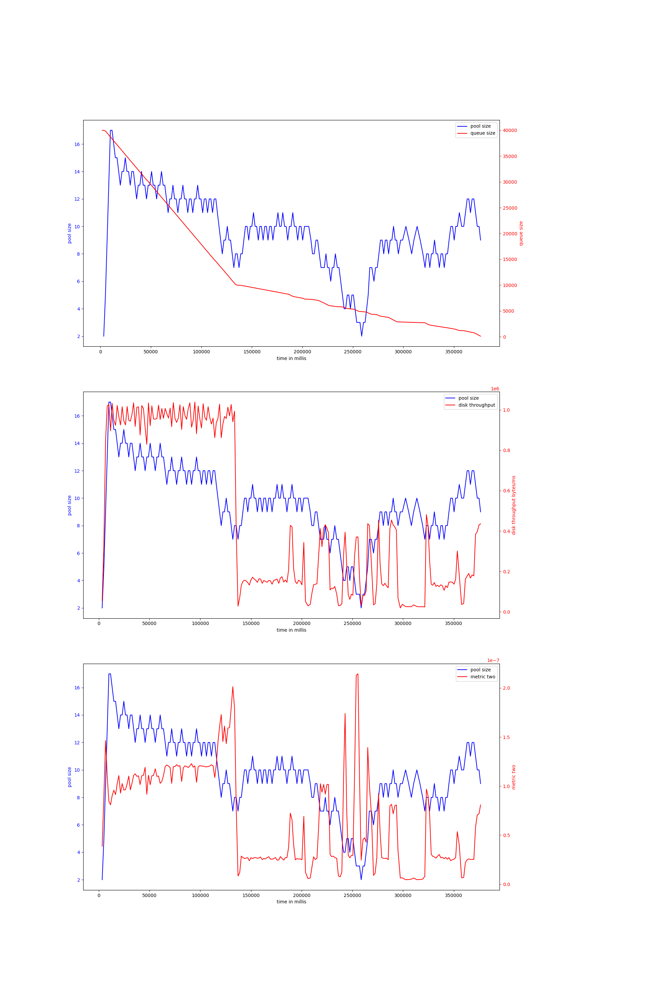

# rust-threadpool-multi-phase
## hdd
## ssd
### rw2mb_sync-nosync-40000
#### v-4-1500,0.9
{ width=100% }
avg pool size: 8.94915254237288

#### v-6-1500,0.9
{ width=100% }
avg pool size: 9.684684684684685

