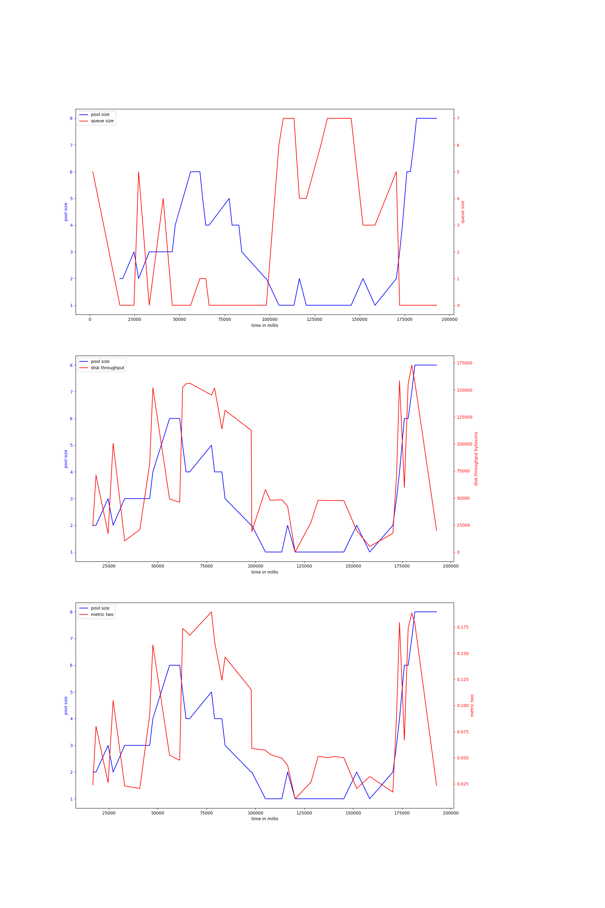
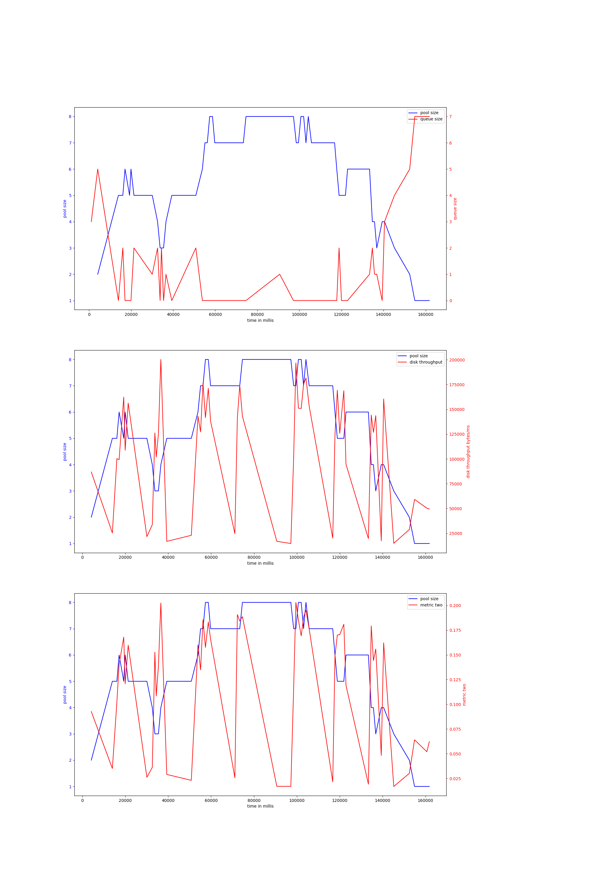
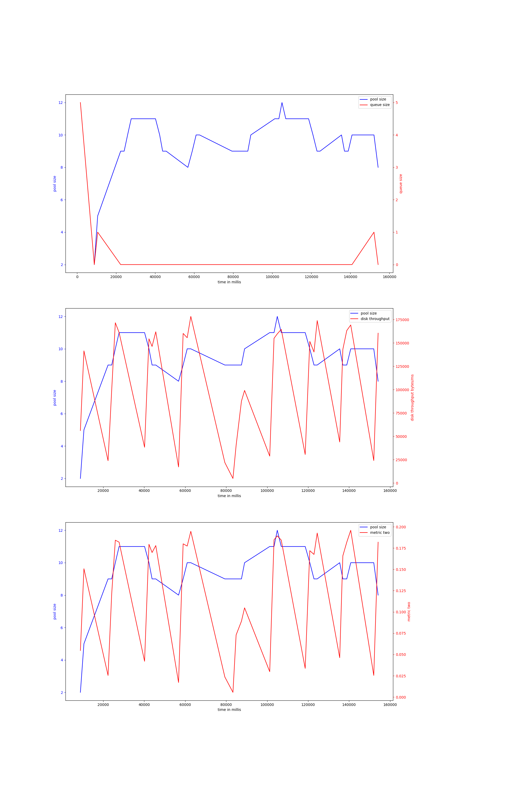
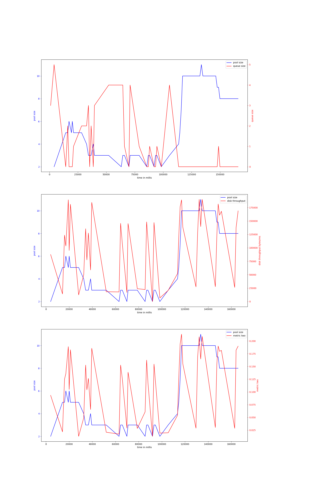
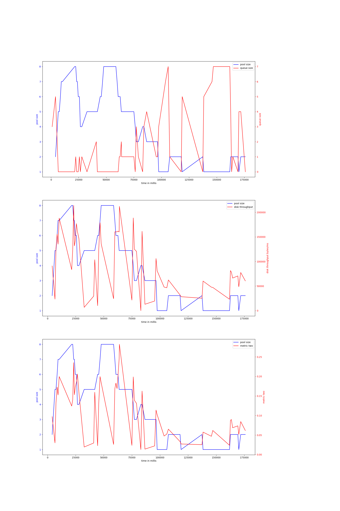

# rocks-io-benchmark
## hdd
## ssd
### bulkload_nocompact-50000000
#### v-4-1500,0.95
{ width=100% }
avg pool size: 3.2051282051282053

#### v-4-1000,0.9
{ width=100% }
avg pool size: 5.352941176470588

#### v-4-1500,0.9
{ width=100% }
avg pool size: 9.333333333333334

#### v-4-1000,0.95
{ width=100% }
avg pool size: 5.404255319148936

#### v-4-800,0.97
{ width=100% }
avg pool size: 4.109090909090909

