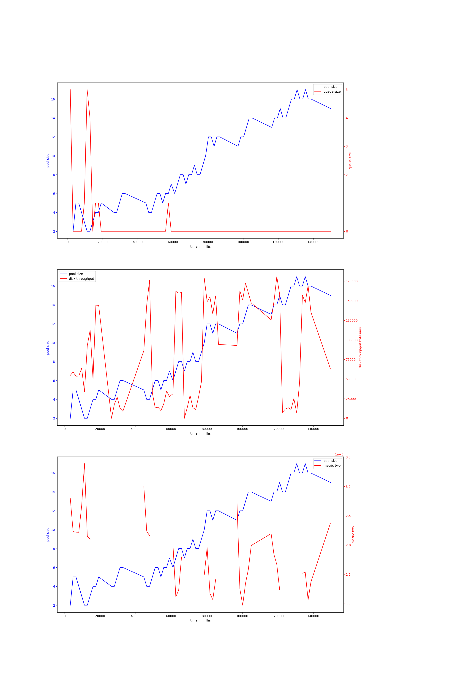
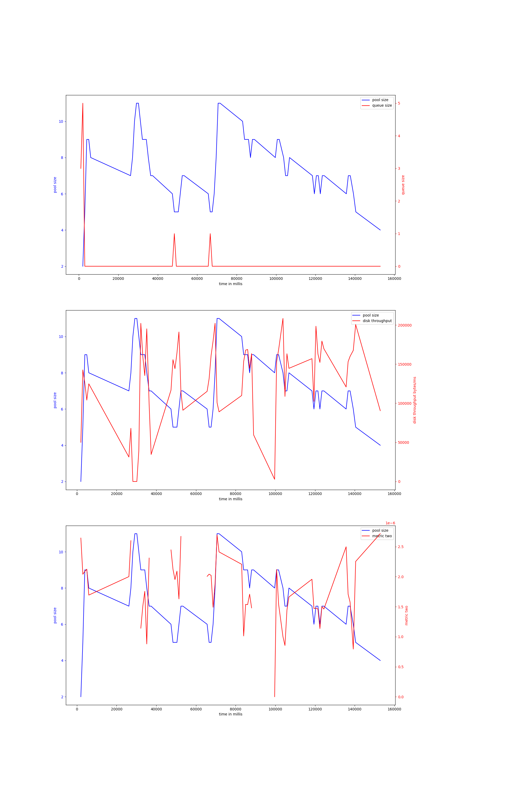

# rocks-io-benchmark
## hdd
## ssd
### bulkload_nocompact-50000000
#### v-4-1000,0.95
{ width=100% }
avg pool size: 10.170731707317072

#### v-4-1000,0.9
{ width=100% }
avg pool size: 3.566371681415929

#### v-4-1500,0.9
{ width=100% }
avg pool size: 4.263888888888889

#### v-4-1500,0.95
{ width=100% }
avg pool size: 6.26984126984127

#### v-4-800,0.97
{ width=100% }
avg pool size: 4.607476635514018

#### v-6-1500,0.95
{ width=100% }
avg pool size: 9.123076923076923

#### v-6-1500,0.9
{ width=100% }
avg pool size: 19.833333333333332

#### v-6-1000,0.95
{ width=100% }
avg pool size: 9.207317073170731

#### v-6-1000,0.9
{ width=100% }
avg pool size: 7.4655172413793105

#### v-6-800,0.97
{ width=100% }
avg pool size: 23.54609929078014

