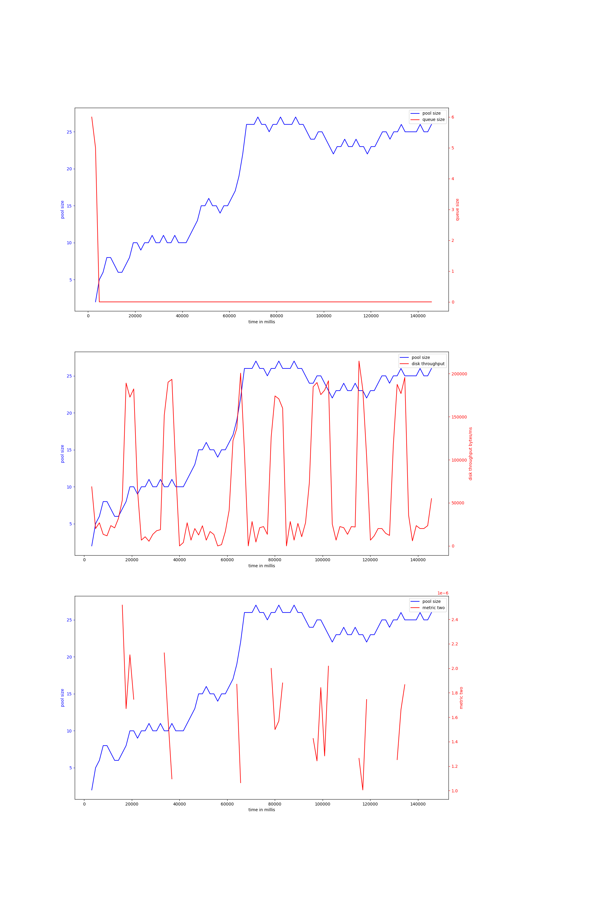
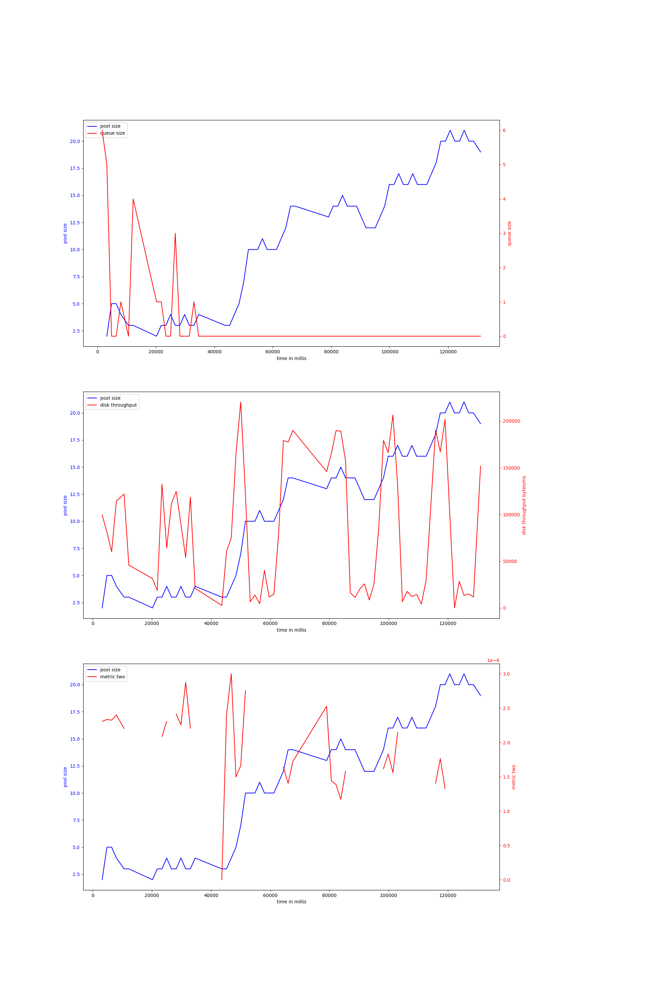
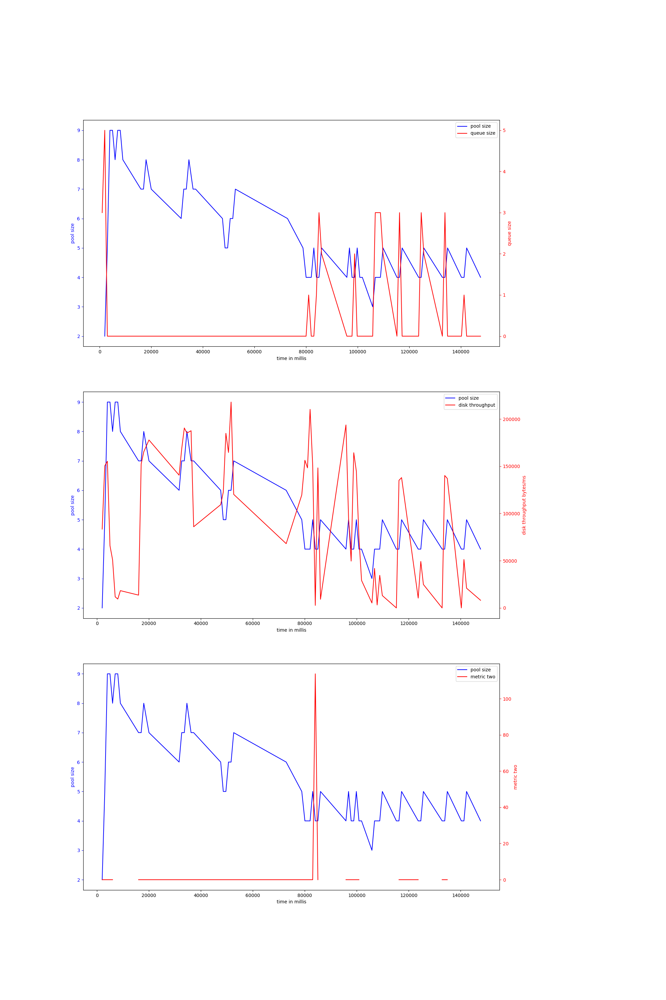
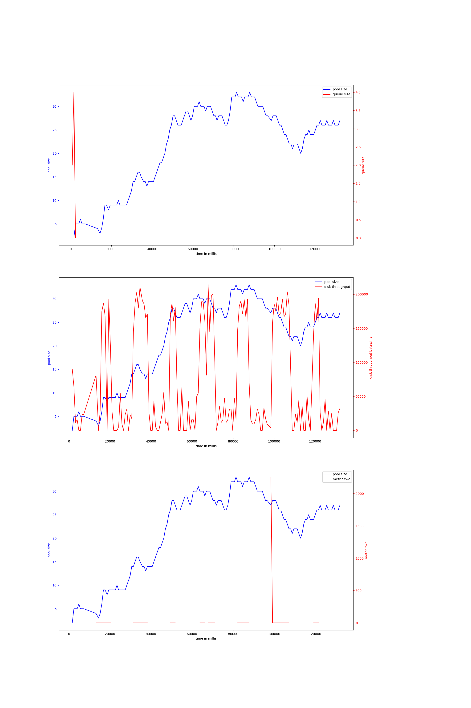
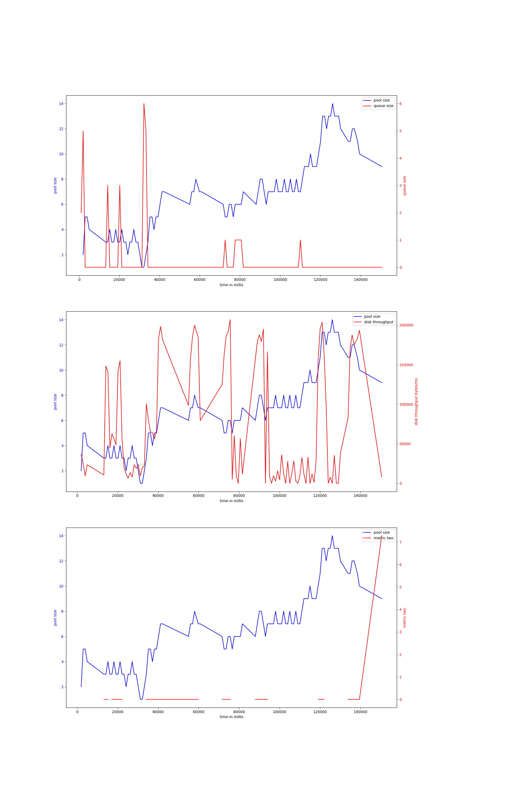

# rocks-io-benchmark
## hdd
## ssd
### fillseq-50000000
#### v-6-1500,0.95
{ width=100% }
avg pool size: 18.72222222222222

#### v-6-1500,0.9
{ width=100% }
avg pool size: 11.292307692307693

#### v-6-1000,0.95
{ width=100% }
avg pool size: 5.379310344827586

#### v-6-800,0.97
{ width=100% }
avg pool size: 22.070967741935483

#### v-6-1000,0.9
{ width=100% }
avg pool size: 6.851485148514851

