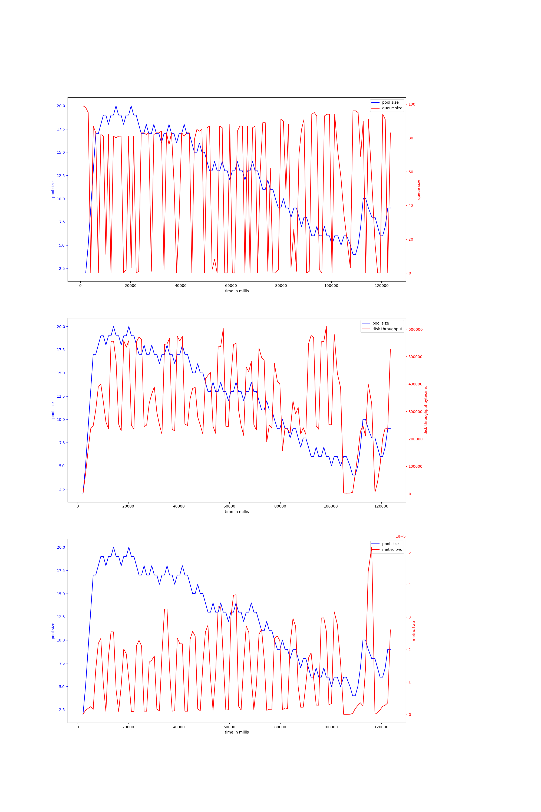
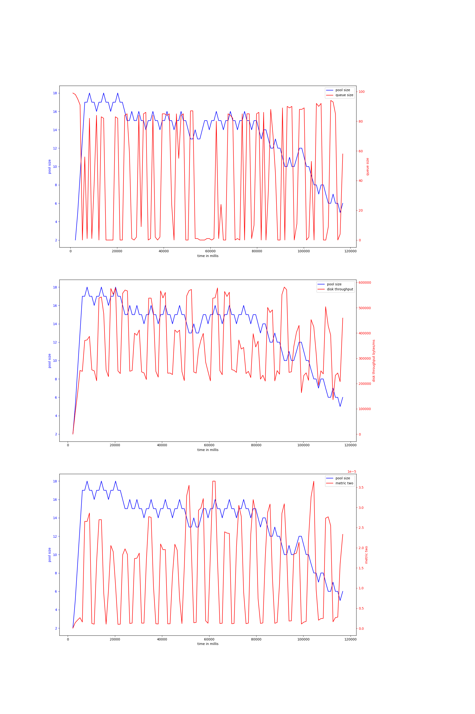
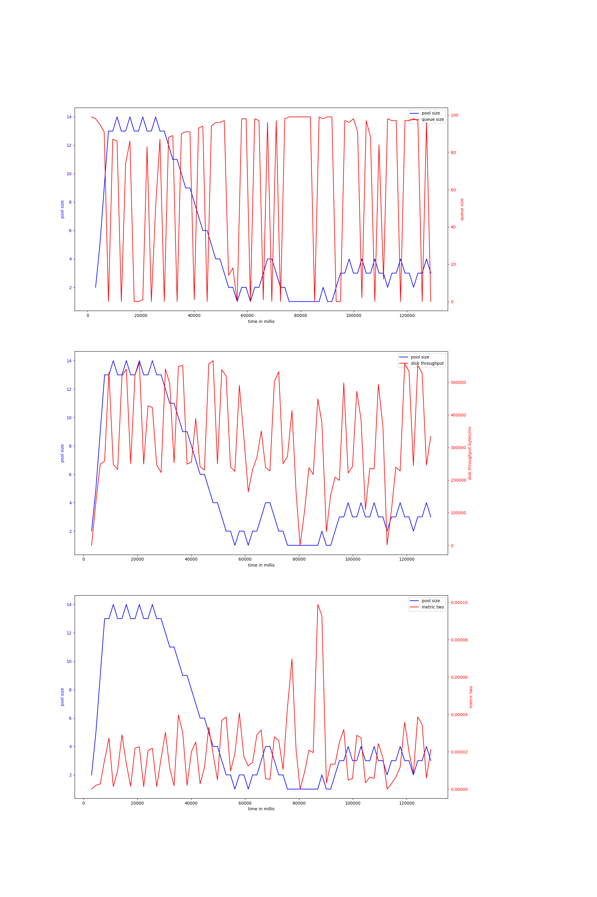
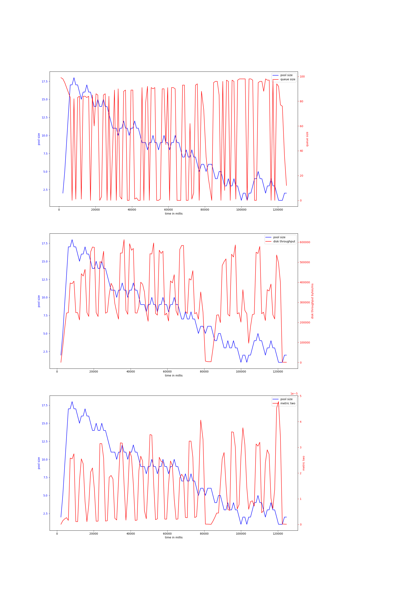
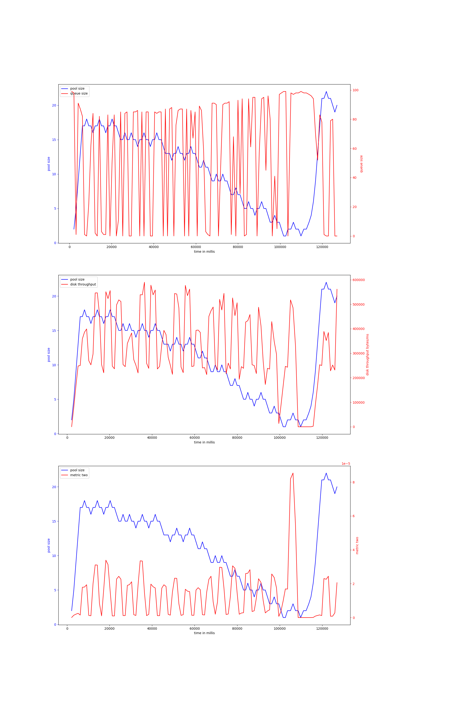
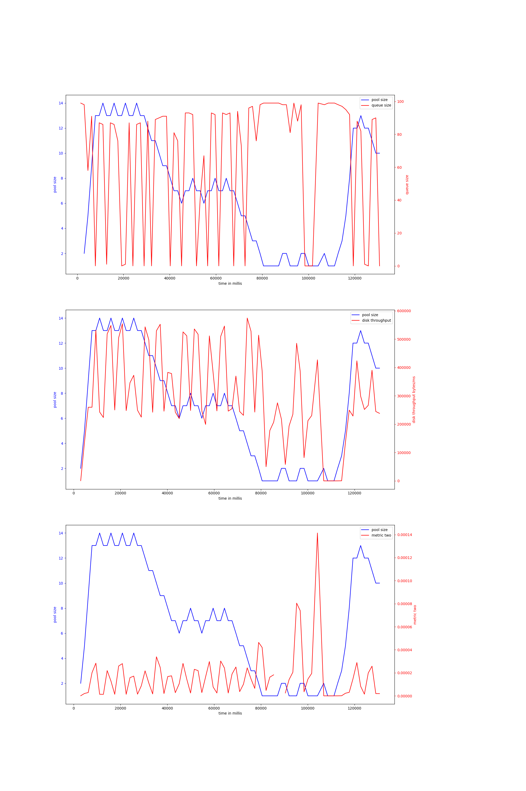

# node-io-benchmark
## hdd
## ssd
### rw_sync_10mb-node-2000
#### v-7-1000,0.95,3000
{ width=100% }
avg pool size: 12.277310924369749

#### v-7-1000,0.97,3000
{ width=100% }
avg pool size: 13.324561403508772

#### v-7-1500,0.95,5000
{ width=100% }
avg pool size: 5.341772151898734

#### v-7-1000,0.95,5000
{ width=100% }
avg pool size: 8.083333333333334

#### v-7-1000,0.97,5000
{ width=100% }
avg pool size: 11.155737704918034

#### v-7-1500,0.95,3000
{ width=100% }
avg pool size: 7.089743589743589

