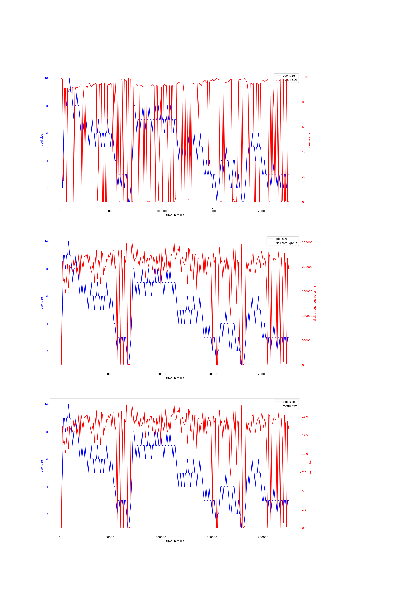
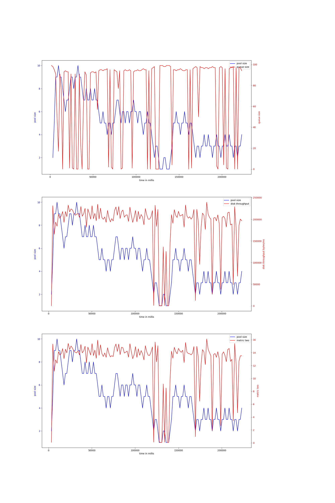
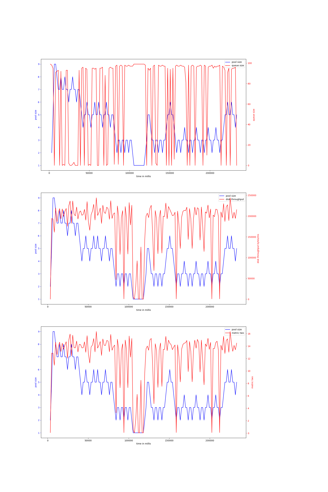
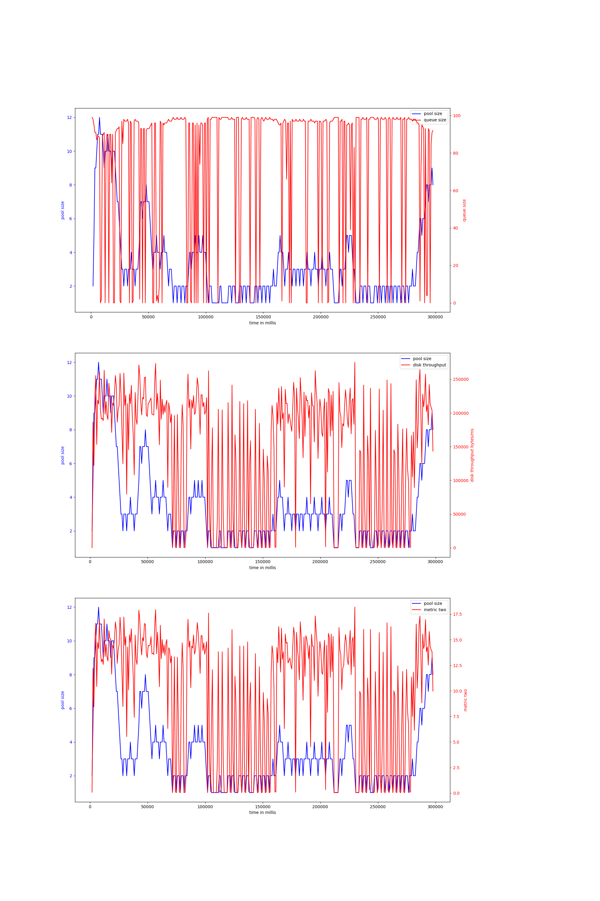
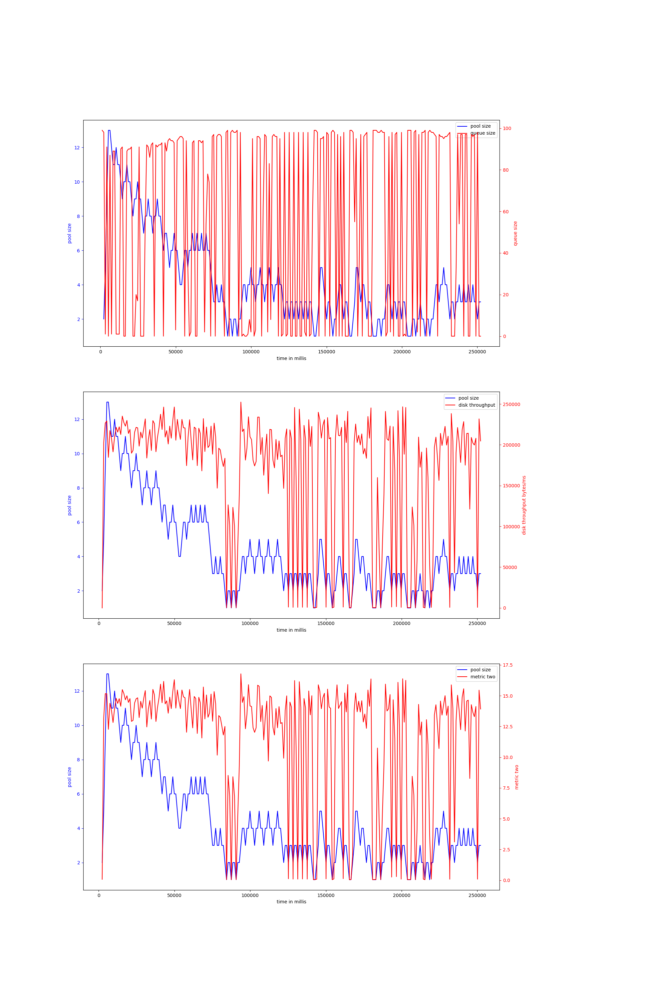
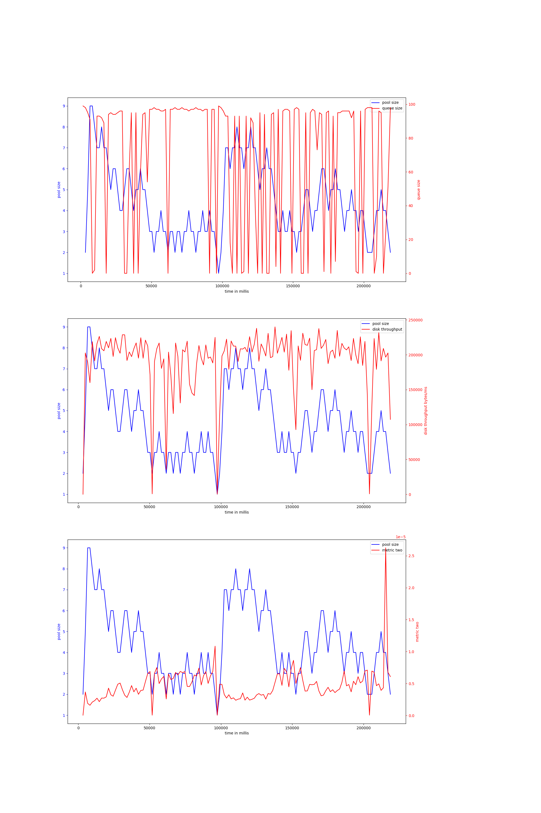
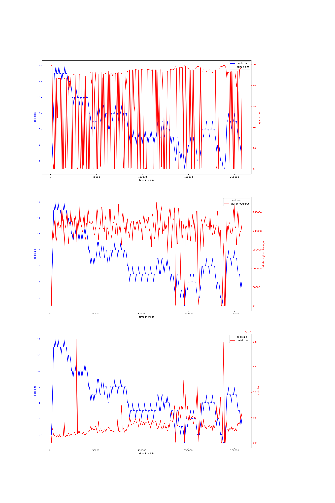
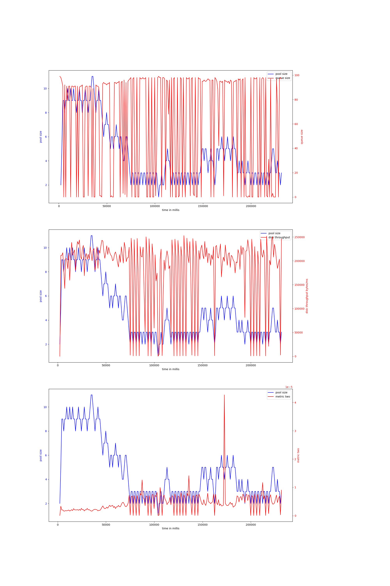
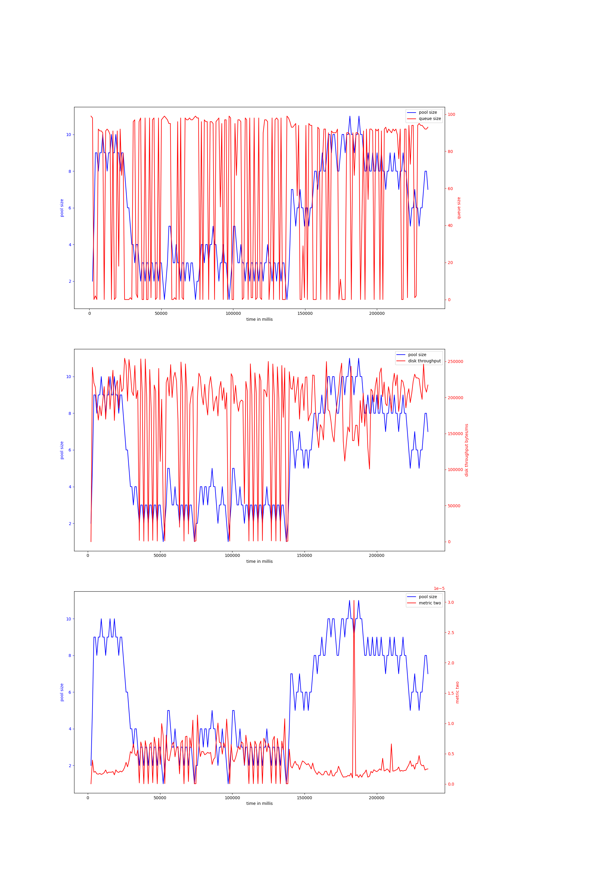
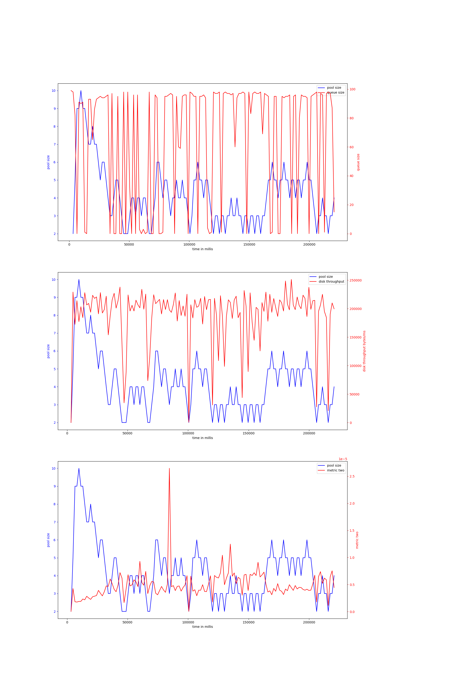

# node-io-benchmark
## hdd
## ssd
### read_2mb-node-20000
#### v-4-1000,0.95
{ width=100% }
avg pool size: 4.918181818181818

#### v-4-1500,0.95
{ width=100% }
avg pool size: 4.927007299270073

#### v-4-1500,0.9
{ width=100% }
avg pool size: 4.048951048951049

#### v-4-800,0.97
{ width=100% }
avg pool size: 3.362116991643454

#### v-4-1000,0.9
{ width=100% }
avg pool size: 4.253061224489796

#### v-6-1500,0.9
{ width=100% }
avg pool size: 4.455223880597015

#### v-6-800,0.97
{ width=100% }
avg pool size: 6.596078431372549

#### v-6-1000,0.9
{ width=100% }
avg pool size: 4.6415929203539825

#### v-6-1000,0.95
{ width=100% }
avg pool size: 5.583333333333333

#### v-6-1500,0.95
{ width=100% }
avg pool size: 4.2

