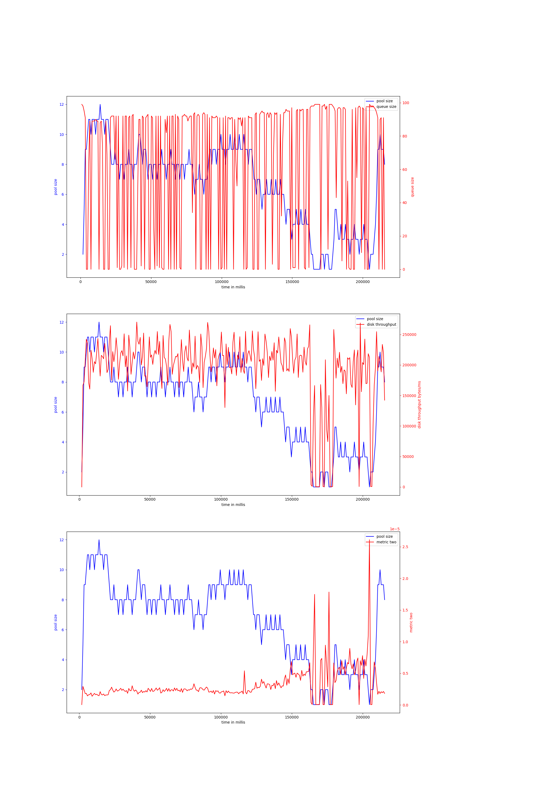
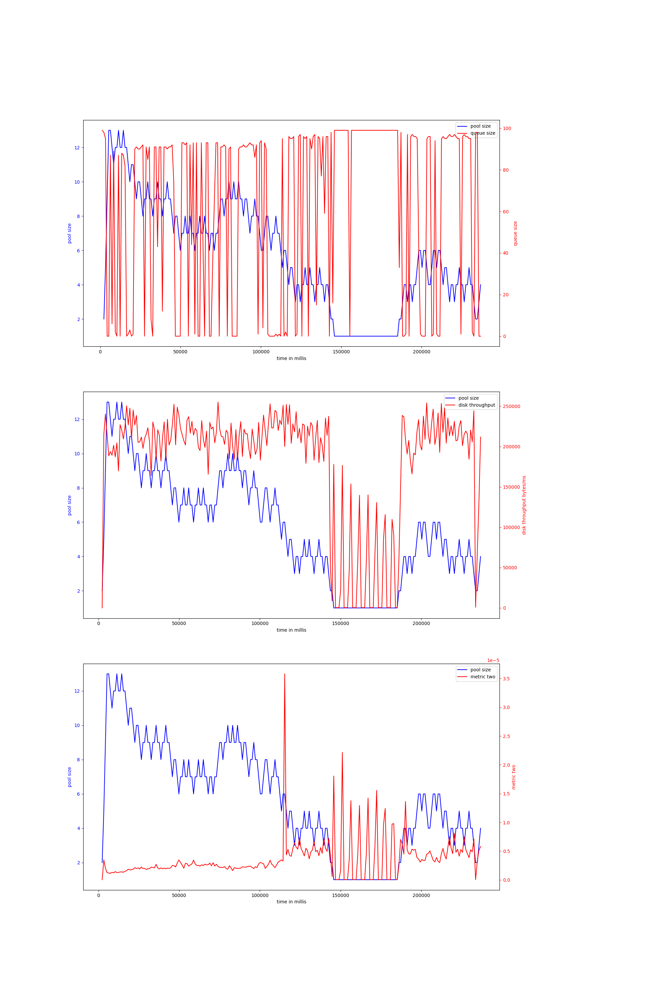
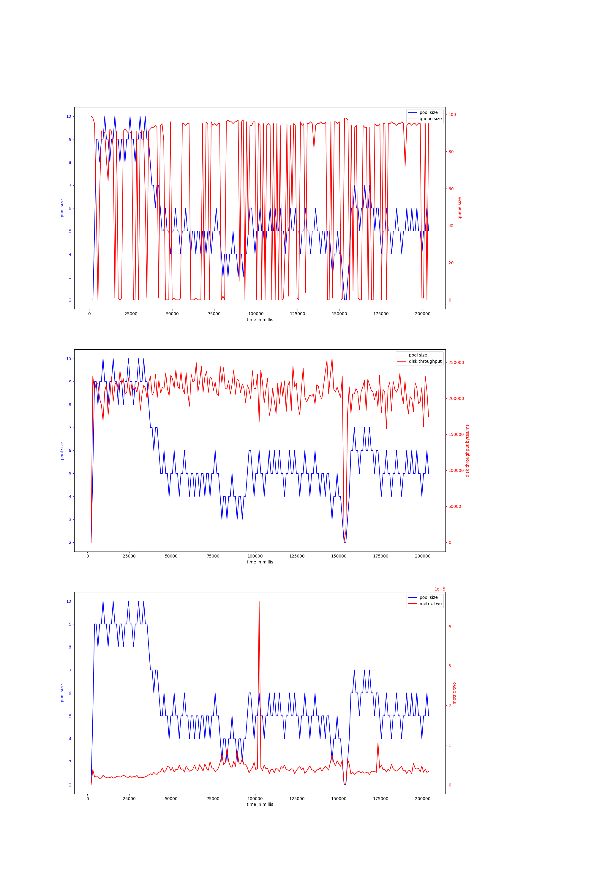
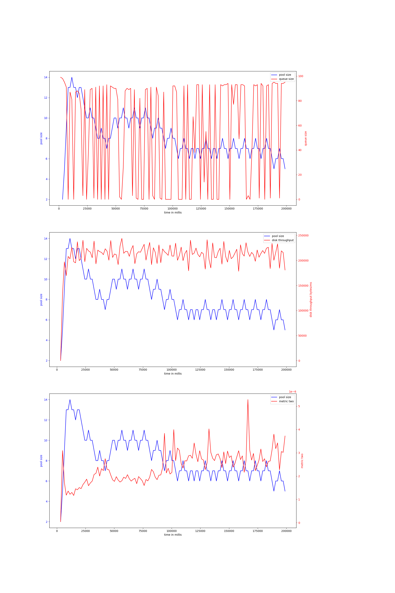
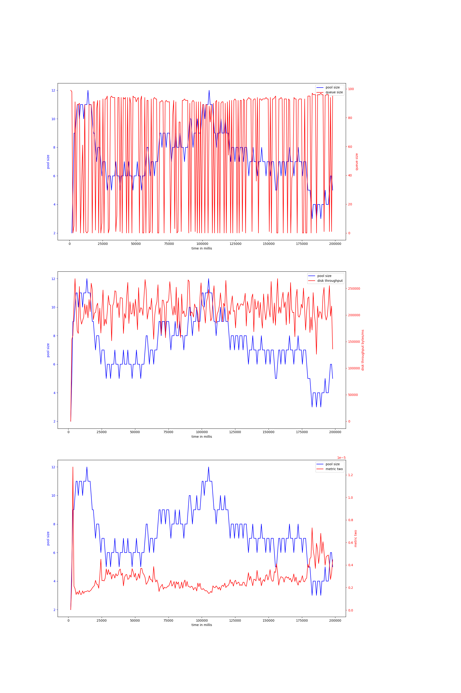
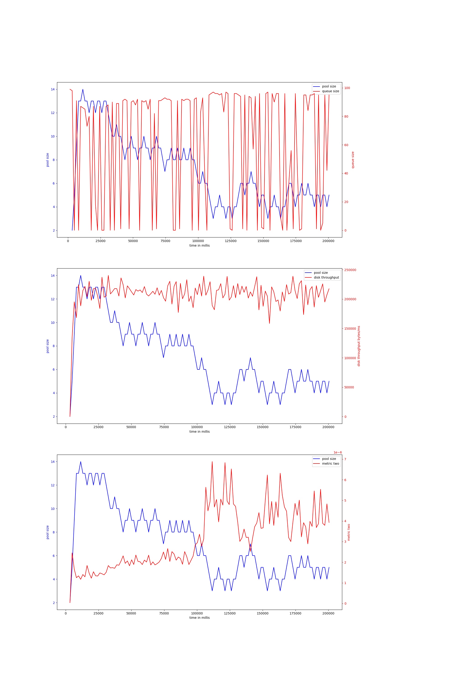
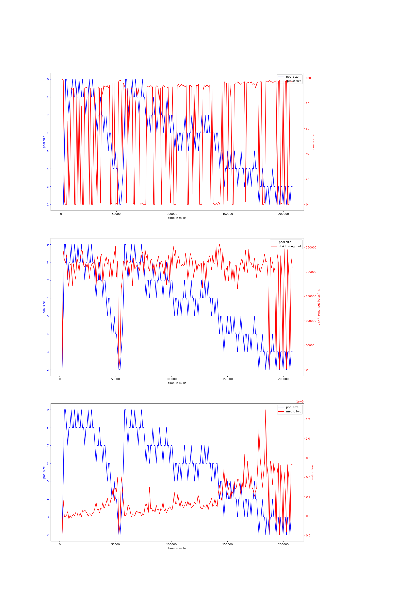
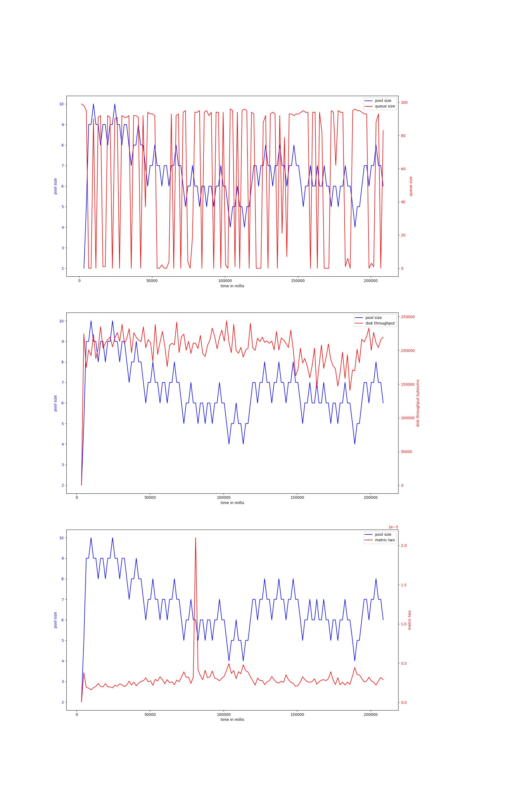

# node-io-benchmark
## hdd
## ssd
### read_2mb-node-20000
#### v-8-800,0.97
{ width=100% }
avg pool size: 6.651515151515151

#### v-8-1000,0.9
{ width=100% }
avg pool size: 5.70995670995671

#### v-8-1000,0.95
{ width=100% }
avg pool size: 5.605

#### v-8-1500,0.97
{ width=100% }
avg pool size: 8.221311475409836

#### v-8-800,0.95
{ width=100% }
avg pool size: 7.413934426229508

#### v-8-1500,0.95
{ width=100% }
avg pool size: 7.162601626016261

#### v-8-1000,0.97
{ width=100% }
avg pool size: 5.6568627450980395

#### v-8-1500,0.9
{ width=100% }
avg pool size: 6.6640625

