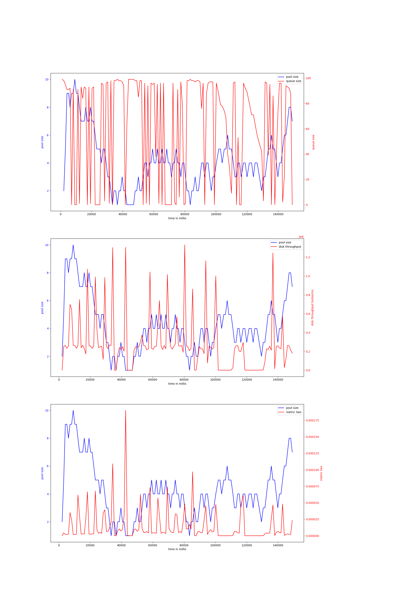

# node-io-benchmark
## hdd
## ssd
### rw_sync_10mb-node-2000
#### v-8-1500,0.97
{ width=100% }
avg pool size: 3.16

#### v-8-1500,0.9
{ width=100% }
avg pool size: 3.6049382716049383

#### v-8-1500,0.95
{ width=100% }
avg pool size: 3.077777777777778

#### v-8-800,0.97
{ width=100% }
avg pool size: 6.586666666666667

#### v-8-1000,0.95
{ width=100% }
avg pool size: 4.100840336134453

#### v-8-1000,0.97
{ width=100% }
avg pool size: 4.2214285714285715

#### v-8-1000,0.9
{ width=100% }
avg pool size: 4.841379310344828

#### v-8-800,0.95
{ width=100% }
avg pool size: 3.3072289156626504

