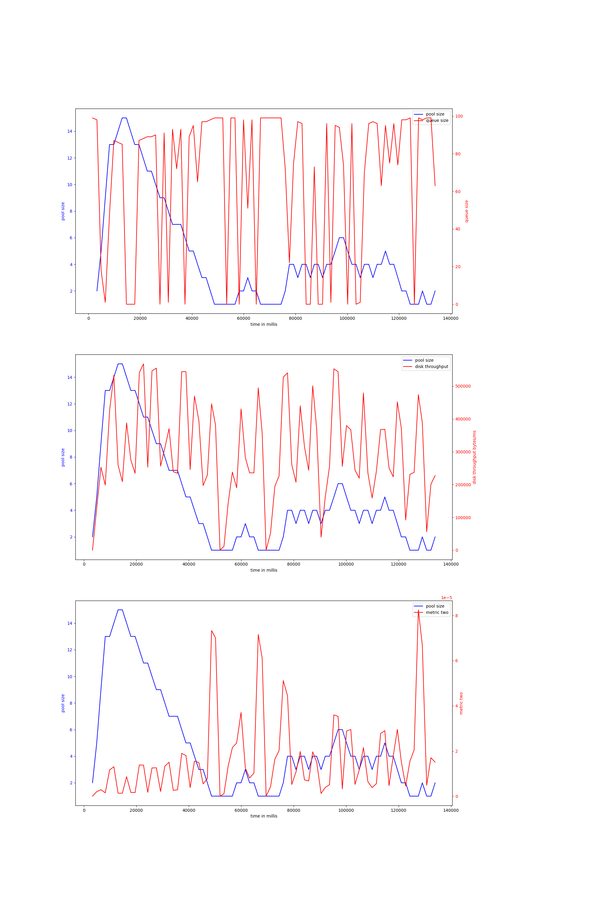

# node-io-benchmark
## hdd
## ssd
### rw_nosync_2mb-node-20000
#### v-7-1000,0.95,10000
{ width=100% }
avg pool size: 9.979508196721312

#### v-7-1000,0.95,8000
{ width=100% }
avg pool size: 9.668085106382978

#### v-7-1500,0.95,8000
{ width=100% }
avg pool size: 16.077272727272728

#### v-7-2000,0.95,8000
{ width=100% }
avg pool size: 6.154471544715447

#### v-7-1000,0.9,8000
{ width=100% }
avg pool size: 10.932432432432432

#### v-7-1000,0.9,10000
{ width=100% }
avg pool size: 14.085585585585585

#### v-7-2000,0.95,10000
{ width=100% }
avg pool size: 6.684210526315789

#### v-7-1500,0.95,10000
{ width=100% }
avg pool size: 5.290123456790123

### rw_sync_10mb-node-2000
#### v-7-1500,0.95,10000
{ width=100% }
avg pool size: 7.1125

#### v-7-1500,0.95,8000
{ width=100% }
avg pool size: 4.780487804878049

#### v-7-1000,0.95,10000
{ width=100% }
avg pool size: 8.007751937984496

#### v-7-1000,0.95,8000
{ width=100% }
avg pool size: 10.771929824561404

#### v-7-2000,0.95,10000
{ width=100% }
avg pool size: 11.203389830508474

#### v-7-2000,0.95,8000
{ width=100% }
avg pool size: 11.155172413793103

#### v-7-1000,0.9,8000
{ width=100% }
avg pool size: 7.647058823529412

#### v-7-1000,0.9,10000
{ width=100% }
avg pool size: 8.552845528455284

