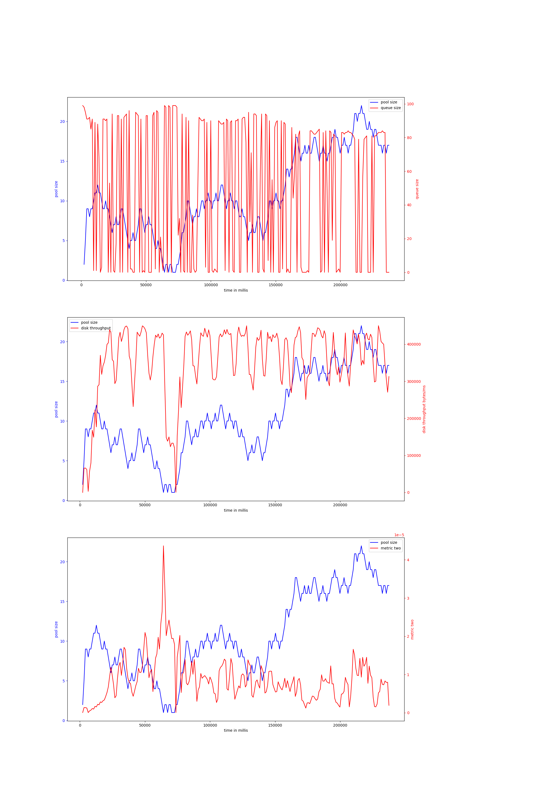
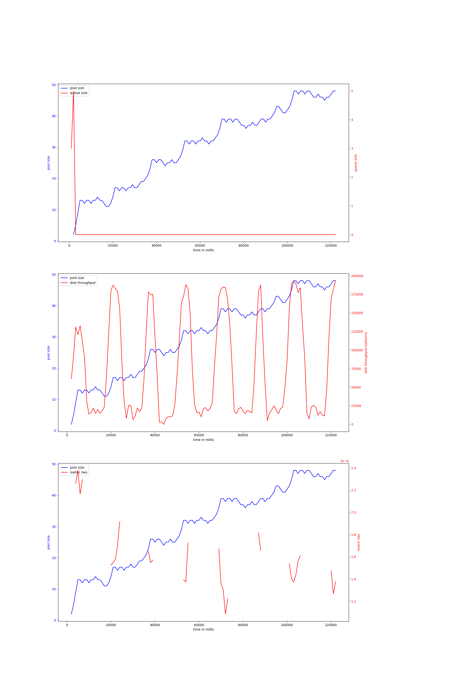

# node-io-benchmark
## hdd
## ssd
### rw_nosync_2mb-node-20000
#### v-7-1000,0.9,3000
{ width=100% }
avg pool size: 10.638766519823788

#### v-7-1000,0.9,5000
{ width=100% }
avg pool size: 10.866952789699571

### rw_sync_10mb-node-2000
#### v-7-1000,0.9,3000
{ width=100% }
avg pool size: 10.067796610169491

#### v-7-1000,0.9,5000
{ width=100% }
avg pool size: 17.90740740740741

# rocks-io-benchmark
## hdd
## ssd
### bulkload_nocompact-50000000
#### v-7-1000,0.95,10000
{ width=100% }
avg pool size: 30.65909090909091

#### v-7-1000,0.9,10000
{ width=100% }
avg pool size: 8.154761904761905

#### v-7-1000,0.9,5000
{ width=100% }
avg pool size: 21.198275862068964

#### v-7-1000,0.9,8000
{ width=100% }
avg pool size: 39.839416058394164

#### v-7-1000,0.95,8000
{ width=100% }
avg pool size: 22.14074074074074

#### v-7-1000,0.9,3000
{ width=100% }
avg pool size: 19.410852713178294

### fillseq-50000000
#### v-7-1000,0.95,8000
{ width=100% }
avg pool size: 23.823529411764707

#### v-7-1000,0.95,3000
{ width=100% }
avg pool size: 15.38

#### v-7-1000,0.9,3000
{ width=100% }
avg pool size: 5.6

#### v-7-1000,0.95,10000
{ width=100% }
avg pool size: 4.183673469387755

#### v-7-1000,0.9,10000
{ width=100% }
avg pool size: 14.104477611940299

#### v-7-1000,0.9,5000
{ width=100% }
avg pool size: 12.34375

#### v-7-1000,0.9,8000
{ width=100% }
avg pool size: 30.545454545454547

#### v-7-1000,0.95,5000
{ width=100% }
avg pool size: 33.04477611940298

