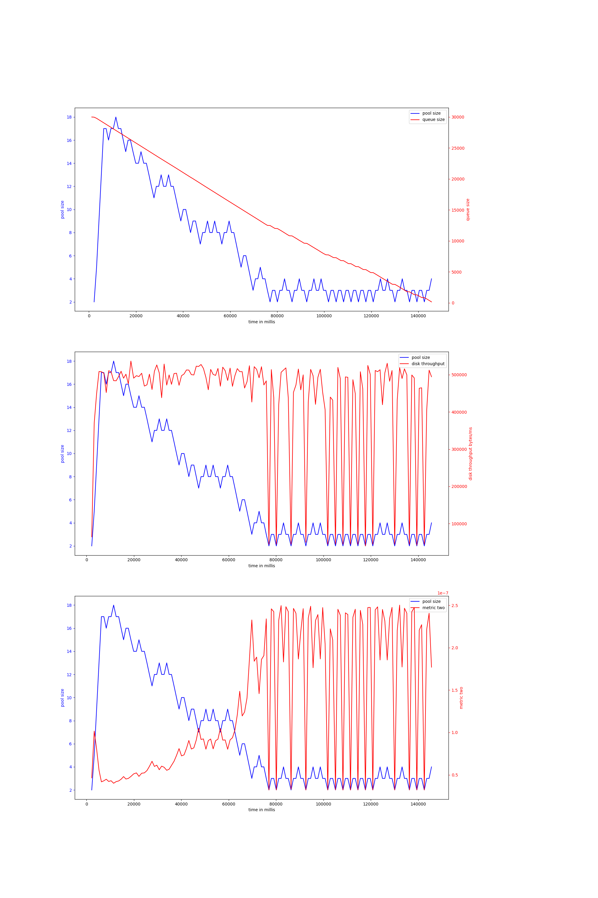
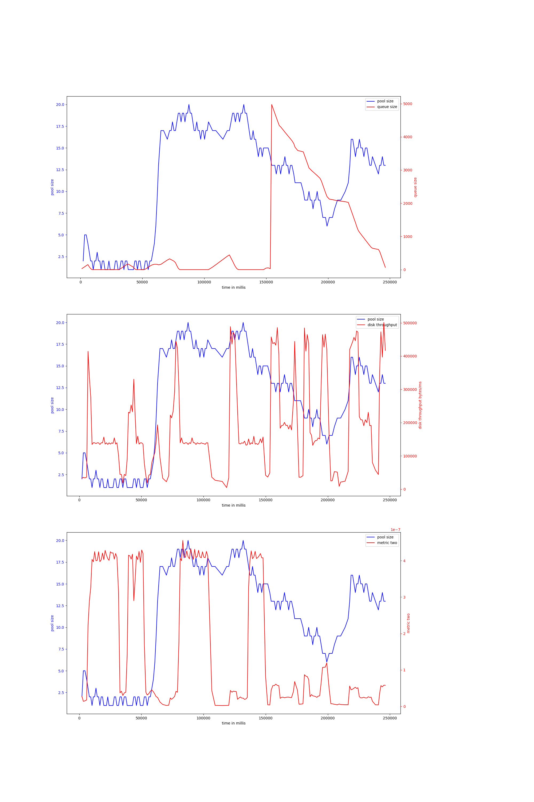

# rust-threadpool-single-phase
## hdd
## ssd
### read_2mb_oneshot-30000
#### v-6-1000,0.95
{ width=100% }
avg pool size: 5.54014598540146

#### v-6-1500,0.95
{ width=100% }
avg pool size: 5.593023255813954

#### v-6-800,0.97
{ width=100% }
avg pool size: 4.621301775147929

#### v-6-1000,0.9
{ width=100% }
avg pool size: 6.633093525179856

### rw_buf_2mb_oneshot-2000
#### v-6-1000,0.9
{ width=100% }
avg pool size: 23.591836734693878

#### v-6-1500,0.95
{ width=100% }
avg pool size: 36.583333333333336

### rw_2mb_oneshot-20000
#### v-6-800,0.97
{ width=100% }
avg pool size: 19.0

#### v-6-1500,0.95
{ width=100% }
avg pool size: 17.96846846846847

#### v-6-1000,0.95
{ width=100% }
avg pool size: 19.880165289256198

# rust-threadpool-multi-phase
## hdd
## ssd
### rw2mb_30ms_oneshot-10000
#### v-6-1000,0.9
{ width=100% }
avg pool size: 10.808290155440414

#### v-6-1000,0.95
{ width=100% }
avg pool size: 15.248730964467006

#### v-6-800,0.97
{ width=100% }
avg pool size: 19.29875518672199

#### v-6-1500,0.95
{ width=100% }
avg pool size: 7.697986577181208

### rw_rwbuf_rw_2mb_oneshot-15000
#### v-6-800,0.97
{ width=100% }
avg pool size: 20.69709543568465

#### v-6-1500,0.95
{ width=100% }
avg pool size: 22.305555555555557

#### v-6-1000,0.9
{ width=100% }
avg pool size: 8.50561797752809

#### v-6-1000,0.95
{ width=100% }
avg pool size: 16.734545454545454

