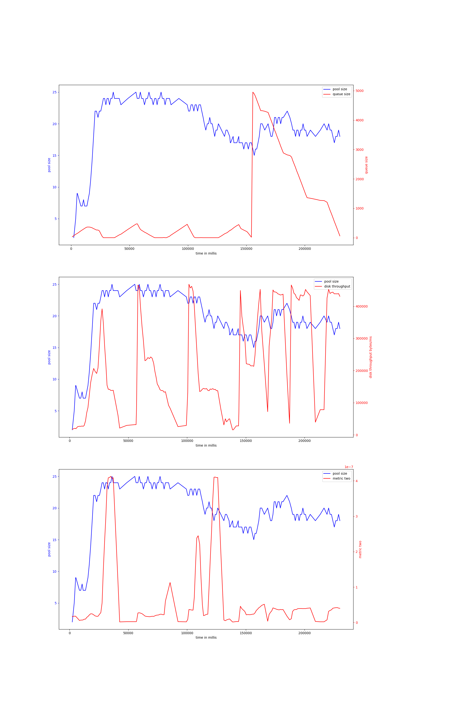

# rust-threadpool-single-phase
## hdd
## ssd
### rw_2mb_oneshot-20000
#### v-7-1500,0.95,5000
{ width=100% }
avg pool size: 24.209424083769633

#### v-7-1000,0.9,3000
{ width=100% }
avg pool size: 16.813432835820894

#### v-7-1000,0.95,5000
{ width=100% }
avg pool size: 35.70982142857143

#### v-7-1500,0.95,3000
{ width=100% }
avg pool size: 16.3125

#### v-7-1000,0.9,5000
{ width=100% }
avg pool size: 24.874524714828897

#### v-7-1000,0.95,3000
{ width=100% }
avg pool size: 24.382113821138212

### rw_buf_2mb_oneshot-2000
#### v-7-1000,0.9,3000
{ width=100% }
avg pool size: 3.942857142857143

#### v-7-1500,0.95,3000
{ width=100% }
avg pool size: 22.976744186046513

#### v-7-1000,0.9,5000
{ width=100% }
avg pool size: 3.370932754880694

#### v-7-1000,0.95,3000
{ width=100% }
avg pool size: 28.02777777777778

#### v-7-1500,0.95,5000
{ width=100% }
avg pool size: 11.960629921259843

#### v-7-1000,0.95,5000
{ width=100% }
avg pool size: 6.422382671480144

### read_2mb_oneshot-30000
#### v-7-1000,0.9,5000
{ width=100% }
avg pool size: 20.765217391304347

#### v-7-1500,0.95,5000
{ width=100% }
avg pool size: 17.632911392405063

#### v-7-1000,0.95,3000
{ width=100% }
avg pool size: 16.21186440677966

#### v-7-1000,0.9,3000
{ width=100% }
avg pool size: 14.966101694915254

#### v-7-1000,0.95,5000
{ width=100% }
avg pool size: 18.854700854700855

#### v-7-1500,0.95,3000
{ width=100% }
avg pool size: 12.050632911392405

# rust-threadpool-multi-phase
## hdd
## ssd
### rw_rwbuf_rw_2mb_oneshot-15000
#### v-7-1500,0.95,5000
{ width=100% }
avg pool size: 16.253658536585366

#### v-7-1000,0.95,5000
{ width=100% }
avg pool size: 39.7008547008547

#### v-7-1000,0.9,3000
{ width=100% }
avg pool size: 14.911764705882353

#### v-7-1500,0.95,3000
{ width=100% }
avg pool size: 16.548223350253807

#### v-7-1000,0.9,5000
{ width=100% }
avg pool size: 24.15481171548117

#### v-7-1000,0.95,3000
{ width=100% }
avg pool size: 17.26271186440678

### rw2mb_30ms_oneshot-10000
#### v-7-1000,0.9,5000
{ width=100% }
avg pool size: 19.39622641509434

#### v-7-1000,0.95,3000
{ width=100% }
avg pool size: 11.655913978494624

#### v-7-1500,0.95,5000
{ width=100% }
avg pool size: 24.83823529411765

#### v-7-1000,0.95,5000
{ width=100% }
avg pool size: 25.966101694915253

#### v-7-1000,0.9,3000
{ width=100% }
avg pool size: 5.519230769230769

#### v-7-1500,0.95,3000
{ width=100% }
avg pool size: 27.024390243902438

